1. Smithsonian National Zoo and Conservation Biology Institute, Conservation Ecology Center, 1500 Remount Rd, Front Royal, VA 22630, USA.

2. Working Land and Seascapes, Conservation Commons, Smithsonian Institution, Washington, DC 20013, USA.

***

This is a guide for modeling species distributions and habitat suitability in Google Earth Engine. This guide is intended to explain the details of the Earth Engine code developed for this manuscript.

We first cover the basics for importing data and setting the main arguments used in different functions, such as, grid size ant the area of interest. We then expand on different modeling workflows using three different case studies to demonstrate how to adapt the code workflow for different goals.

For information on how to set up a Google Earth Engine account as well as user guidelines and tutorials visit: <https://developers.google.com/earth-engine/>

The code found below can also be accessed through the GEE repository for this study:
<https://code.earthengine.google.com/?accept_repo=users/ramirocrego84/SDM_Manuscript>


# General settings for running SDMs in Google Earth Engine

## Importing species location data as an asset

Datasets need to be uploaded as assets in Google Earth Engine. The easiest way to do this is by creating a csv file with spatial coordinates and any other desired information. Note that you can also upload an ESRI Shapefile with the species location data.

Below is an example for uploading the *Bradypus variegatus* data set from a `csv` file. Prepare a `csv` file with coordinates in latitude and longitude (EPSG:4326). To include a column with date use format Year-Month-Day (e.g., 2000-01-30).


## Loading and cleaning your species data

To import the asset into your active script you can click on the forward arrow icon on your asset manager or you can use code to programmatically load the data as a new object. We recommend using code to import data. To import the asset with your species presence data, use the `ee.FeatureCollection()` function and provide the asset ID. For example:

```{js, eval=F}
var Data = ee.FeatureCollection('users/yourfolder/yourdata');
```

One important step in modeling species distributions is to limit the potential effect of geographic sampling bias on the model output due to data aggregation resulting from multiple nearby observations.

We thin the location data to one randomly selected occurrence record per pixel at the chosen spatial resolution (the raster pixel or grain size of the analysis).

Here, we will apply a function to remove all points that lay within the same raster cell at a given grain size. For this, we first need to define the spatial resolution of our study.


```{js, eval=F}
// Define spatial resolution to work with (m)
var GrainSize = 10000; // e.g. 10 km
```

Then, we can define a function to remove duplicates and apply it to the species data set.

```{js, eval=F}
function RemoveDuplicates(data){
  var randomraster = ee.Image.random().reproject('EPSG:4326', null, GrainSize);
  var randpointvals = randomraster.sampleRegions({collection:ee.FeatureCollection(data), scale: 10, geometries: true});
  return randpointvals.distinct('random');
}

var Data = RemoveDuplicates(Data);
```

The following figure exemplifies how points are rarefied at a 1 km grain size.

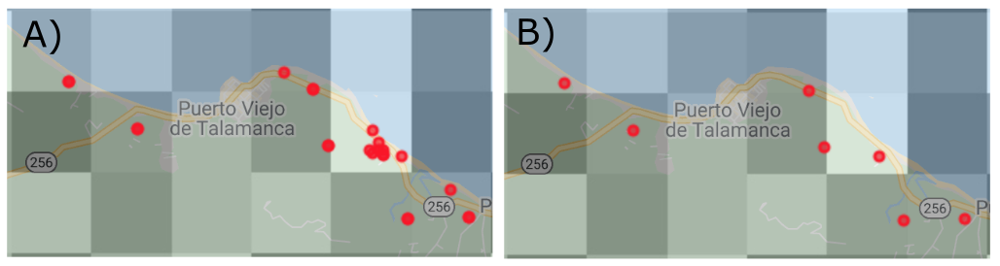


You can evaluate the number of points before and after removing duplicates.

```{js, eval=F}
print(ee.FeatureCollection('users/yourfolder/yourimage').size())
print(Data.size())
```

## Define your area of interest for modeling

There are different ways you can define your area of interest. You can directly draw a polygon using the drawing tools in GEE or manually set the polygon (e.g., Case Study 2 in this tutorial). Here, we present two methods for automating this process. 

If you are interested in working with a specific country or continent, you can use the Large Scale International Boundary Polygons data set available in GEE catalog. 

Here an example to select Kenya:

```{js, eval=F}
// Load region boundary from data catalog if working at a larger scale
var AOI = ee.FeatureCollection('USDOS/LSIB_SIMPLE/2017').filter(ee.Filter.eq('country_co', 'KE'));
```

You can see the list of country codes at: <https://en.wikipedia.org/wiki/List_of_FIPS_country_codes>

If you are interested in working within the entire African continent, you can use:

```{js, eval=F}
// Load country boundary from data catalog if working at a country scale
var AOI = ee.FeatureCollection('USDOS/LSIB_SIMPLE/2017').filter(ee.Filter.eq('wld_rgn', 'Africa'));
```

Another option is to select a bounding box around your species location data. For example, we can define a bounding box using the function `bounds()` and add a buffer of 50 km. 

```{js, eval=F}
// Define the area of interest
var AOI = Data.geometry().bounds().buffer(50000);
```

To display the study area on the map use the following code and assign the map layer the name ‘AOI’:

```{js, eval=F}
// Add AOI to the map
Map.addLayer(AOI, {}, 'AOI', 1); // The number 1 indicates the zoom level. Higher numbers increases zoom level.
```

## Selecting predictor variables

One of the main advantages of implementing SDMs in Google Earth Engine is to make use of the large number of datasets available as predictor variables. This includes not only the bioclimatic variables from Hijmans et al. (2005), but elevation data and derivatives (slope, aspect, hillside, etc.), diverse vegetation indices, human modification indices, nighttime light images, water bodies, hourly climatic data, land cover classifications, roads or other infrastructure and even the raw pixel values of satellite data. Depending on your area of interest, certain regions have greater data availability. GEE also offers the opportunity to directly include user-derived datasets in your analysis, such as processed satellite imagery (e.g., a land cover classification that you previously developed for your area of interest).

Selecting predictor variables is a step in which the researcher needs to rely on existing knowledge of the study species, such as the variables that may affect its distribution, etc.

To find spatial data sets, you can use the search bar. All information related to each spatial dataset is available by clicking on the name of the product. The code necessary to import the dataset is available as shown in the following figure.


```{js, eval=F}
// Example of code to import the SRTM Digital Elevation Data 30m
var Elev = ee.Image("USGS/SRTMGL1_003");
```

Note that the GEE function `ee.Algorithms.Terrain()` allows you to calculate slope, aspect, and hillshade from the elevation dataset.

We will demonstrate different ways to import and manipulate spatial data sets with the specific examples below.

## Defining an area to create pseudo-absences

When using presence only data, the most common methodology when using data from online databases such as, GBIF, it is important to define the area to create pseudo-absences. Here we show how to implement three different methodologies. In all three, first we create a mask of the location of the presence data to avoid randomly generating pseudo-absences at the same pixel than presences. 

a) Generate random pseudo-absences across the entire study area. Not recommended.

```{js, eval=F}
// Make an image out of the presence locations. The pixels where we have presence locations will be removed from the area to generate pseudo-absences.
// This will impede having presence and pseudo-absences in the same pixel. 
var mask = Data
  .reduceToImage({
    properties: ['random'],
    reducer: ee.Reducer.first()
}).reproject('EPSG:4326', null, ee.Number(GrainSize));

var AreaForPA = mask.mask().updateMask(watermask).clip(AOI);
```


b) Generate pseudo-absences within a specified distance from presence locations to limit pseudo-absences to areas potentially accessible to the species (Araújo et al., 2019) and to account for the potential geographical or environmental sampling bias of presence records by creating pseudo-absences with a similar sampling bias (Phillips et al., 2009). The `buffer()` function determines the area available for generating pseudo-absences, assuming that these areas have the same sampling bias than the records and represent areas where animals can disperse. The `buffer()` function has two arguments, the distance in meters for the buffer and the maximum amount of error tolerated when approximating the buffer circle. Larger maximum errors improve computing efficiency.

```{js, eval=F}
// Make an image out of the presence locations. The pixels where we have presence locations will be removed from the area to generate pseudo-absences.
// This will impede having presence and pseudo-absences in the same pixel. 
var mask = Data
  .reduceToImage({
    properties: ['random'],
    reducer: ee.Reducer.first()
}).reproject('EPSG:4326', null, ee.Number(GrainSize));

// Option 2: Spatially constrained pseudo-absence selection to a buffer around presence points.
var buffer = 500000; // Distance in meters.
var AreaForPA = Data.geometry().buffer(buffer, 1000);
var AreaForPA = mask.mask().clip(AreaForPA).updateMask(watermask).clip(AOI);
right.addLayer(AreaForPA, {},'Area to create pseudo-absences', 0);
```

c) Limit the area to select pseudo-absences by implementing an environmental profiling technique, masking out the known environmentally suitable locations, similar to other two-steps methods for generating pseudo-absences (). 

This method requires fitting a cluster function to the occurrence data. When you have a large presence dataset, you can randomly choose a subset of the data with this line of code: `Data.randomColumn().sort('random').limit(200)` where the number in `limit()` specifies the number of random presence used to train the clusterer. A critical step is to display the cluster results and identify the correct cluster, zero or one, to use for creation of pseudo-absences. The cluster ID is assigned in a non consistent manner and can change even when changing the order of the same data input. It is important then to display and visually identify the correct cluster ID to create the mask: `var mask2 = Clresult.select(['cluster']).eq(1)`.

```{js, eval=F}
// Make an image out of the presence locations. The pixels where we have presence locations will be removed from the area to generate pseudo-absences.
// This will impede having presence and pseudo-absences in the same pixel. 
var mask = Data
  .reduceToImage({
    properties: ['random'],
    reducer: ee.Reducer.first()
}).reproject('EPSG:4326', null, ee.Number(GrainSize));

//Option 3: Environmental pseudo-absences selection (environmental profiling)
// Extract environmental values for the presence data
var PixelVals = predictors.sampleRegions({collection: Data.randomColumn().sort('random').limit(200), properties: [], tileScale: 16, scale: GrainSize});
// Instantiate the clusterer and train it using euclidean distance.
var clusterer = ee.Clusterer.wekaKMeans({nClusters:2, distanceFunction:"Euclidean"}).train(PixelVals);
// Cluster the input using the trained clusterer.
var Clresult = predictors.cluster(clusterer);
// Display cluster results and identify the cluster ID similar and dissimilar to presence data
right.addLayer(Clresult.randomVisualizer(), {}, 'Clusters', 0);
// Mask cluster that is disimilar to presence data. In this case, cluster 1.
var mask2 = Clresult.select(['cluster']).eq(1)
var AreaForPA = mask.mask().updateMask(mask2).clip(AOI);

// Display area for creation of pseudo-absence
right.addLayer(AreaForPA, {},'Area to create pseudo-absences', 0);
```


***

# Case Study 1: Modeling *Bradypus variegatus* habitat suitability and predicted distribution using presence-only data

To demonstrate the basic code to conduct SDMs in Google Earth Engine, we will use *Bradypus variegatus* as a case study. This species has been widely used to present other SDM software and R packages (Hijmans et al., 2017; Kindt, 2018; Phillips et al., 2017, 2006)  and allows as to compare GEE outputs with other tools. We obtained occurrence data from GBIF (GBIF.org [20 January 2021] GBIF Occurrence Download https://doi.org/10.15468/dl.jxcv7e). We filtered data to the period from 2000 to 2020, retaining only georeferenced records with a coordinate uncertainty < 250 m. We further cleaned the data set by removing all locations that fall on top of buildings or water bodies assuming they had incorrect coordinates.

## Loading species location data

We upload the presence data set, specify the spatial scale to work with and randomly select one occurrence location per 1km grid cell.

Note that the following code modifies the `ui.root` to display two maps on the map panel of the user interface, one for the habitat suitability map and one for the potential distribution map.

```{js, eval=F}
///////////////////////////////
// Section 1 - Species data
///////////////////////////////

// Load presence data
var Data = ee.FeatureCollection('users/ramirocrego84/BradypusVariegatus');
print('Original data size:', Data.size());

// Define spatial resolution to work with (m)
var GrainSize = 5000;

function RemoveDuplicates(data){
  var randomraster = ee.Image.random().reproject('EPSG:4326', null, GrainSize);
  var randpointvals = randomraster.sampleRegions({collection:ee.FeatureCollection(data), scale: 10, geometries: true});
  return randpointvals.distinct('random');
}

var Data = RemoveDuplicates(Data);
print('Final data size:', Data.size());

// Add two maps to the screen.
var left = ui.Map();
var right = ui.Map();
ui.root.clear();
ui.root.add(left);
ui.root.add(right);

// Link maps, so when you drag one map, the other will be moved in sync.
ui.Map.Linker([left, right], 'change-bounds');

// Visualize presence points on the map
//right.addLayer(Data, {color:'red'}, 'Presence', 1);
//left.addLayer(Data, {color:'red'}, 'Presence', 1);
```

> In JavaScript you can activate or inactivate lines of code by using //. JavaScript will omit all the text that comes after the //. Commenting out code that prints objects or adds elements to the map is a good practice to keep the code clean. Sometimes it can help reducing the chance of reaching memory limits as we reduce the number of processes being called. Another option is to use /* code */. All code in between will be inactivated.

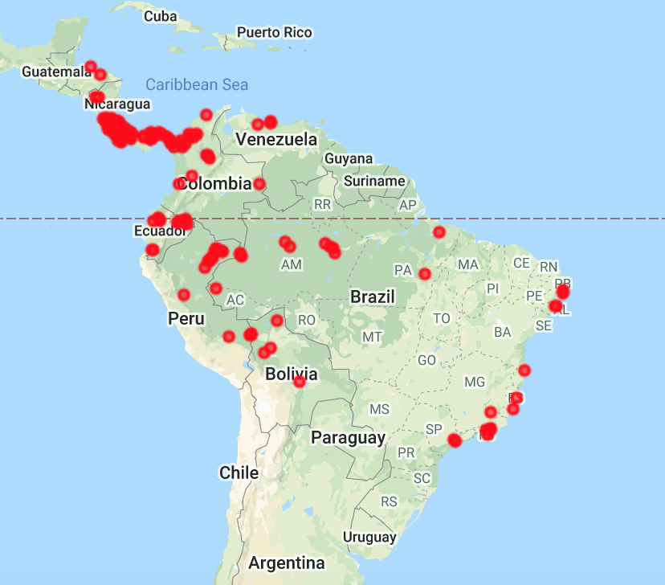

## Defining the area of interest

The next step is to define the extent of the area of interest. Here we defined a 100 km buffer around the bounding box containing all presence data. The argument for the buffer distance is in meters.

```{js, eval=F}
////////////////////////////////////////////
// Section 2 - Define Area of Interest
////////////////////////////////////////////

// Define the AOI
var AOI = Data.geometry().bounds().buffer(50000, 1000);

// Add border of study area to the map
var outline = ee.Image().byte().paint({
  featureCollection: AOI, color: 1, width: 3});
right.addLayer(outline, {palette: 'FF0000'}, "Study Area");
left.addLayer(outline, {palette: 'FF0000'}, "Study Area");

// Center each map to the area of interest
right.centerObject(AOI, 4); //Number indicates the zoom level
left.centerObject(AOI, 4); //Number indicates the zoom level
```

> Note in the code we are using right and left instead of the default Map statement now that we have divided the interactive map into two elements, ‘right’ and ‘left’.

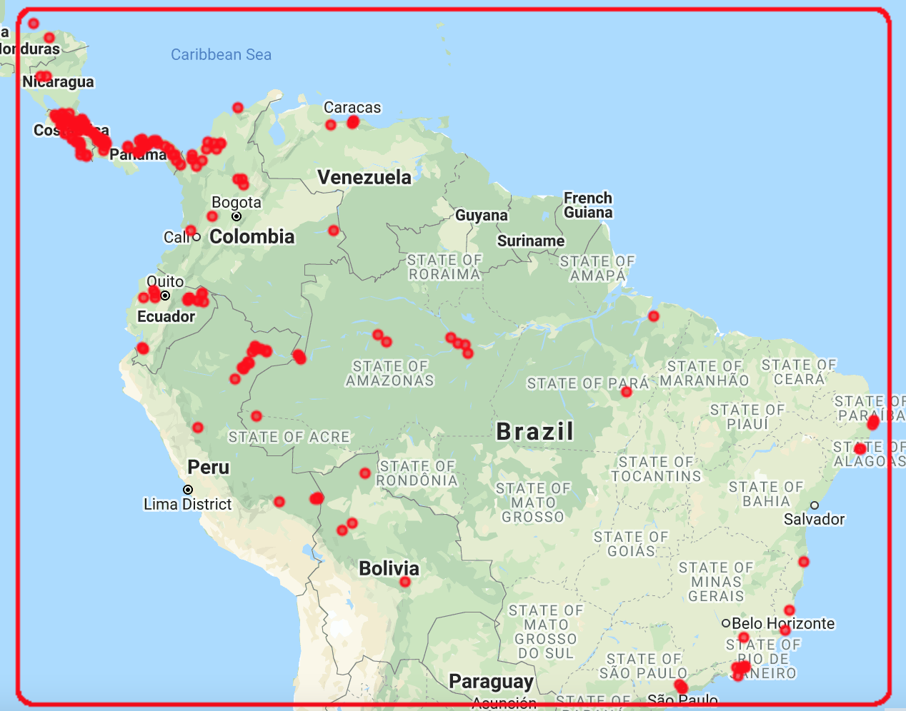

## Loading predictor variables

For this example, we selected a combination of climatic predictor variables (temperature seasonality, maximum temperature of warmest month, minimum temperature of coldest month and annual precipitation) obtained from (Hijmans et al. 2005), elevation (Farr et al. 2007) and percentage tree cover at 250 m resolution obtained from the Terra MODIS Vegetation Continuous Fields (VCF) product. The VCF product is generated yearly and produced using monthly composites of Terra MODIS Land Surface Reflectance data. We estimated mean percentage tree cover for the period of the occurrence data, 2003 to 2020.All predictor variables need to be combined as bands into a single multi-band image. We also mask oceans from the image.

The calculation of the median percentage tree cover for each pixel across the annual MODIS images shows how powerful Google Earth Engine can be for raster processing when creating predictor variables.


```{js, eval=F}
////////////////////////////////////////////////
// Section 3 - Selecting Predictor Variables
////////////////////////////////////////////////

// Load WorldClim BIO Variables (a multiband image) from the data catalog
var BIO = ee.Image("WORLDCLIM/V1/BIO");

// Load elevation data from the data catalog and calculate slope, aspect, and a simple hillshade from the terrain Digital Elevation Model.
var Terrain = ee.Algorithms.Terrain(ee.Image("USGS/SRTMGL1_003"));

// Load NDVI 250 m collection and estimate median tree cover value per pixel
var MODIS = ee.ImageCollection("MODIS/006/MOD44B");
var MedianPTC = MODIS.filterDate('2003-01-01', '2020-12-31').select(['Percent_Tree_Cover']).median();

// Combine bands into a single multi-band image
var predictors = BIO.addBands(Terrain).addBands(MedianPTC);

// Mask ocean pixels from the predictor variable image
var watermask =  Terrain.select('elevation').gt(0); //Create a water mask
var predictors = predictors.updateMask(watermask).clip(AOI);

// Select subset of bands to keep for habitat suitability modeling
var bands = ['bio04','bio05','bio06','bio12','elevation','Percent_Tree_Cover'];
var predictors = predictors.select(bands);

// Display layers on the map
right.addLayer(predictors, {bands:['elevation'], min: 0, max: 5000,  palette: ['000000','006600', '009900','33CC00','996600','CC9900','CC9966','FFFFFF',]}, 'Elevation (m)', 0);
right.addLayer(predictors, {bands:['bio05'], min: 190, max: 400, palette:'white,red'}, 'Temperature seasonality', 0); 
right.addLayer(predictors, {bands:['bio12'], min: 0, max: 4000, palette:'white,blue'}, 'Annual Mean Precipitation (mm)', 0); 
right.addLayer(predictors, {bands:['Percent_Tree_Cover'], min: 1, max: 100, palette:'white,yellow,green'}, 'Percent_Tree_Cover', 0); 
```

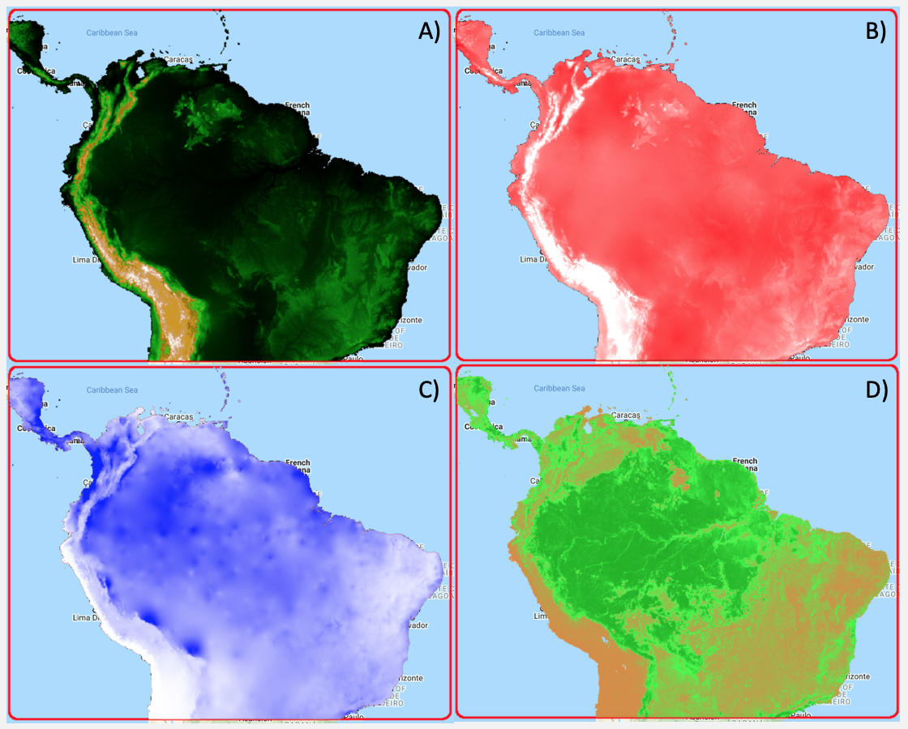

It is important to make sure that there is no significant correlation among predictor variables that can cause collinearity. We account for this by estimating the Spearman correlation among predictor variable values at 5000 random locations. Highly correlated predictor variables should not be included in the same model.

```{js, eval=F}
// Estimate correlation among predictor variables

// Extract local covariate values from multiband predictor image at 5000 random points
var DataCor = predictors.sample({scale: GrainSize, numPixels: 5000, geometries: true}); //Generate 5000 random points
var PixelVals = predictors.sampleRegions({collection: DataCor, scale: GrainSize, tileScale: 16}); //Extract covariate values

// To check all pairwise correlations we need to map the reduceColumns function across all pairwise combinations of predictors
var CorrAll = predictors.bandNames().map(function(i){
    var tmp1 = predictors.bandNames().map(function(j){
      var tmp2 = PixelVals.reduceColumns({
        reducer: ee.Reducer.spearmansCorrelation(),
        selectors: [i, j]
      });
    return tmp2.get('correlation');
    });
    return tmp1;
  });
print('Variables correlation matrix',CorrAll);
```

> This is a function that requires high memory to GEE as it is working with a large feature collection. Once you have run the correlation code and selected the final set of covariables to use, it is recommended to comment out the print function so the correlations between predictor variables are not run repeatedly. 

## Creating pseudo-absences

In this example, we use presence only data, the most common methodology when using data from online databases such as, GBIF. We will generate pseudo-absences to fit the model. But first, we need to define the area in which random pseudo-absences can be generated. 

We used a two-step environmental profiling approach to restrict the area for the creation of pseudo-absences. We first fit a cluster with Euclidean distance to the presence data and then created random pseudo-absences within the area of the cluster more dissimilar to the presence data. 


```{js, eval=F}
////////////////////////////////////////////////////////////////////////////////////////////////////////
// Section 4 - Defining area for pseudo-absences and spatial blocks for model fitting and cross validation
////////////////////////////////////////////////////////////////////////////////////////////////////////

// Make an image out of the presence locations. The pixels where we have presence locations will be removed from the area to generate pseudo-absences.
// This will impede having presence and pseudo-absences in the same pixel. 
var mask = Data
  .reduceToImage({
    properties: ['random'],
    reducer: ee.Reducer.first()
}).reproject('EPSG:4326', null, ee.Number(GrainSize));

// Option 1: Simple random pseudo-absence selection across the entire area of interest.
// var AreaForPA = mask.mask().updateMask(watermask).clip(AOI);

// Option 2: Spatially constrained pseudo-absence selection to a buffer around presence points.
//var buffer = 500000; // Distance in meters.
//var AreaForPA = Data.geometry().buffer(buffer, 1000);
//var AreaForPA = mask.mask().clip(AreaForPA).updateMask(watermask).clip(AOI);
//right.addLayer(AreaForPA, {},'Area to create pseudo-absences', 0);

//Option 3: Environmental pseudo-absences selection (environmental profiling)
// Extract environmental values for the presence data
var PixelVals = predictors.sampleRegions({collection: Data.randomColumn().sort('random').limit(200), properties: [], tileScale: 16, scale: GrainSize});
// Instantiate the clusterer and train it using euclidean distance.
var clusterer = ee.Clusterer.wekaKMeans({nClusters:2, distanceFunction:"Euclidean"}).train(PixelVals);
// Cluster the input using the trained clusterer.
var Clresult = predictors.cluster(clusterer);
// Display cluster results and identify the cluster ID similar and dissimilar to presence data
right.addLayer(Clresult.randomVisualizer(), {}, 'Clusters', 0);
// Mask cluster that is disimilar to presence data. In this case, cluster 1.
var mask2 = Clresult.select(['cluster']).eq(1)
var AreaForPA = mask.mask().updateMask(mask2).clip(AOI);

// Display area for creation of pseudo-absence
right.addLayer(AreaForPA, {},'Area to create pseudo-absences', 0);
```


For this case study we implement a block repeated split-sample cross-validation technique to randomly partition data for model training and validation (Roberts et al., 2017; Valavi, Elith, Lahoz-Monfort, & Guillera-Arroita, 2019). We will then run multiple model iterations with random block splits to create training and validation data sets.

The argument `scale` determines the range in m for each block. In this case we are using 200 km.

```{js, eval=F}
// Define a function to create a grid over AOI
function makeGrid(geometry, scale) {
  // pixelLonLat returns an image with each pixel labeled with longitude and
  // latitude values.
  var lonLat = ee.Image.pixelLonLat();
  // Select the longitude and latitude bands, multiply by a large number then
  // truncate them to integers.
  var lonGrid = lonLat
    .select('longitude')
    .multiply(100000)
    .toInt();
  var latGrid = lonLat
    .select('latitude')
    .multiply(100000)
    .toInt();
  return lonGrid
    .multiply(latGrid)
    .reduceToVectors({
      geometry: geometry.buffer(20000,1000),
      scale: scale,
      geometryType: 'polygon',
    });
}
// Create grid and remove cells outside AOI
var Scale = 200000; // Set range in m to create spatial blocks
var grid = makeGrid(AOI, Scale);
var Grid = watermask.reduceRegions({collection: grid, reducer: ee.Reducer.mean()}).filter(ee.Filter.neq('mean',null));
right.addLayer(Grid, {},'Grid for spatail block cross validation', 0);
```

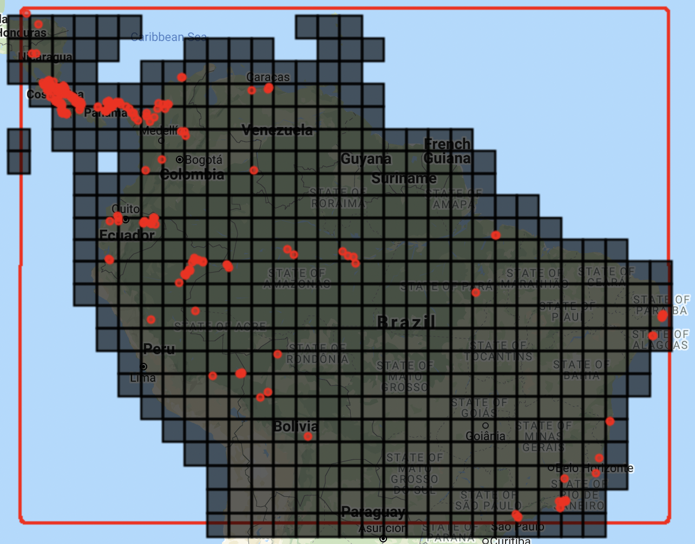


## Model fit, model validation and model predictions

We can now fit the models. There are several functions that need to be defined.

The first function allows us to create random seeds for splitting spatial blocks and generating pseudo-absences at each iteration.

```{js, eval=F}
//////////////////////////////////
// Section 5 - Fitting SDM models
//////////////////////////////////

// Define function to generate a vector of random numbers between 1 and 1000
function runif(length) {
    return Array.apply(null, Array(length)).map(function() {
        return Math.round(Math.random() * (1000 - 1) + 1)
    });
}
```


We need to define a function to fit models.

There are several non-parametric classification algorithms available in GEE that can be implemented. These include random forest, support vector machine, classification and regression trees, maximum entropy, and gradient boosting.

We implement a 10 block repeated split-sample cross-validation technique. The number of pseudo-absences is balanced with the number of presences for the training and validation data sets, as this practice is recommended for machine learning classifiers (Evans et al., 2011; Barbet-Massin et al. 2012). In this case, we will use random forest. But note that in the `SDM` function, we also provide the code to fit gradient boosting classifiers. To change the classifier, you need to comment out the random forest function call using two forward slashes (`//`) and activate the gradient boosting classifier.

We use the `setOutputMode()` function to obtain results as `PROBABILITY` and as `CLASSIFICATION`. This allows us to obtain a binary output (i.e., predicted presence) to quickly visualize in the interactive map. Later we will show how to define a threshold to transform the probability output into a binary map.

At each iteration, the spatial blocks will be randomly split into 70% for model fitting and 30% for model validation, respectively. Consequently, each of the 10 runs will have a different set of presence and pseudo-absence points for model fitting and validation.


```{js, eval=F}
// Define SDM function
// Activate the desired classifier, random forest or gradient boosting. 
// Note that other algorithms are available in GEE. See ee.Classifiers on the documentation for more information.

function SDM(x) {
    var Seed = ee.Number(x);
    
    // Randomly split blocks for training and validation
    var GRID = ee.FeatureCollection(Grid).randomColumn({seed:Seed}).sort('random');
    var TrainingGrid = GRID.filter(ee.Filter.lt('random', split));  // Filter points with 'random' property < split percentage
    var TestingGrid = GRID.filter(ee.Filter.gte('random', split));  // Filter points with 'random' property >= split percentage

    // Presence
    var PresencePoints = ee.FeatureCollection(Data);
    PresencePoints = PresencePoints.map(function(feature){return feature.set('PresAbs', 1)});
    var TrPresencePoints = PresencePoints.filter(ee.Filter.bounds(TrainingGrid));  // Filter presence points for training 
    var TePresencePoints = PresencePoints.filter(ee.Filter.bounds(TestingGrid));  // Filter presence points for testing
    
    // Pseudo-absences
    var TrPseudoAbsPoints = AreaForPA.sample({region: TrainingGrid, scale: GrainSize, numPixels: TrPresencePoints.size().add(300), seed:Seed, geometries: true}); // We add extra points to account for those points that land in masked areas of the raster and are discarded. This ensures a balanced presence/pseudo-absence data set
    TrPseudoAbsPoints = TrPseudoAbsPoints.randomColumn().sort('random').limit(ee.Number(TrPresencePoints.size())); //Randomly retain the same number of pseudo-absences as presence data 
    TrPseudoAbsPoints = TrPseudoAbsPoints.map(function(feature){
        return feature.set('PresAbs', 0);
        });
    
    var TePseudoAbsPoints = AreaForPA.sample({region: TestingGrid, scale: GrainSize, numPixels: TePresencePoints.size().add(100), seed:Seed, geometries: true}); // We add extra points to account for those points that land in masked areas of the raster and are discarded. This ensures a balanced presence/pseudo-absence data set
    TePseudoAbsPoints = TePseudoAbsPoints.randomColumn().sort('random').limit(ee.Number(TePresencePoints.size())); //Randomly retain the same number of pseudo-absences as presence data 
    TePseudoAbsPoints = TePseudoAbsPoints.map(function(feature){
        return feature.set('PresAbs', 0);
        });

    // Merge points
    var trainingPartition = TrPresencePoints.merge(TrPseudoAbsPoints);
    var testingPartition = TePresencePoints.merge(TePseudoAbsPoints);

    // Extract local covariate values from multiband predictor image at training points
    var trainPixelVals = predictors.sampleRegions({collection: trainingPartition, properties: ['PresAbs'], scale: GrainSize, tileScale: 16, geometries: true});

    // Classify using random forest
    var Classifier = ee.Classifier.smileRandomForest({
       numberOfTrees: 500, //The number of decision trees to create.
       variablesPerSplit: null, //The number of variables per split. If unspecified, uses the square root of the number of variables.
       minLeafPopulation: 10,//Only create nodes whose training set contains at least this many points. Integer, default: 1
       bagFraction: 0.5,//The fraction of input to bag per tree. Default: 0.5.
       maxNodes: null,//The maximum number of leaf nodes in each tree. If unspecified, defaults to no limit.
       seed: Seed//The randomization seed.
      });
    
    // Classify using a gradient boosting
    // var ClassifierPr = ee.Classifier.smileGradientTreeBoost({
    //   numberOfTrees:500, //The number of decision trees to create.
    //   shrinkage: 0.005, //The shrinkage parameter in (0, 1) controls the learning rate of procedure. Default: 0.005
    //   samplingRate: 0.7, //The sampling rate for stochastic tree boosting. Default 0.07
    //   maxNodes: null, //The maximum number of leaf nodes in each tree. If unspecified, defaults to no limit.
    //   loss: "LeastAbsoluteDeviation", //Loss function for regression. One of: LeastSquares, LeastAbsoluteDeviation, Huber.
    //   seed:Seed //The randomization seed.
    // });
  
    // Presence probability 
    var ClassifierPr = Classifier.setOutputMode('PROBABILITY').train(trainPixelVals, 'PresAbs', bands); 
    var ClassifiedImgPr = predictors.select(bands).classify(ClassifierPr);
    
    // Binary presence/absence map
    var ClassifierBin = Classifier.setOutputMode('CLASSIFICATION').train(trainPixelVals, 'PresAbs', bands); 
    var ClassifiedImgBin = predictors.select(bands).classify(ClassifierBin);
   
    return ee.List([ClassifiedImgPr, ClassifiedImgBin, trainingPartition, testingPartition]);
}
```

Now we need to define some parameters before executing the SDM function. A variable with the percentage for data split, and a variable with the number of iterations to run.

```{js, eval=F}
// Define partition for training and testing data
var split = 0.70;  // // The proportion of the blocks used to select training data

// Define number of repetitions
var numiter = 10;
```

We can now map the model function. Instead of generating random numbers, we will manually set 10 random numbers for reproducibility of results. The length of the list of random seeds determines the number of iterations of model fitting and validation to run.

```{js, eval=F}
// Fit SDM 
//var RanSeeds = runif(numiter)
//var results = ee.List(RanSeeds).map(SDM)

// While the runif function can be used to generate random seeds, we map the SDM function over random created numbers for reproducibility of results
var results = ee.List([35,68,43,54,17,46,76,88,24,12]).map(SDM);

// Extract results from list
var results = results.flatten();
//print(results); //Activate this line to visualize all elements
```

Now we can extract the model predictions and display them on the maps. Note we will also create some legends for each map.

```{js, eval=F}
///////////////////////////////////////////////////////////////////
// Section 6 - Extracting and displaying model prediction results
///////////////////////////////////////////////////////////////////

// Habitat suitability

// Set visualization parameters
var visParams = {
  min: 0,
  max: 1,
  palette: ["#440154FF","#482677FF","#404788FF","#33638DFF","#287D8EFF",
  "#1F968BFF","#29AF7FFF","#55C667FF","#95D840FF","#DCE319FF"],
};

// Extract all model predictions
var images = ee.List.sequence(0,ee.Number(numiter).multiply(4).subtract(1),4).map(function(x){
  return results.get(x)});

// You can add all the individual model predictions to the map. The number of layers to add will depend on how many iterations you selected.

// left.addLayer(ee.Image(images.get(0)), visParams, 'Run1');
// left.addLayer(ee.Image(image.get(1)), visParams, 'Run2');

// Calculate mean of all individual model runs
var ModelAverage = ee.ImageCollection.fromImages(images).mean();

// Add final habitat suitability layer and presence locations to the map
left.addLayer(ModelAverage, visParams, 'Habitat Suitability');
left.addLayer(Data, {color:'red'}, 'Presence', 1);

// Create legend for habitat suitability map.
var legend = ui.Panel({style: {position: 'bottom-left', padding: '8px 15px'}});

legend.add(ui.Label({
  value: "Habitat suitability",
  style: {fontWeight: 'bold', fontSize: '18px', margin: '0 0 4px 0', padding: '0px'}
}));

legend.add(ui.Thumbnail({
  image: ee.Image.pixelLonLat().select(0),
  params: {
    bbox: [0,0,1,0.1],
    dimensions: '200x20',
    format: 'png',
    min: 0,
    max: 1,
    palette: ["#440154FF","#482677FF","#404788FF","#33638DFF","#287D8EFF",
  "#1F968BFF","#29AF7FFF","#55C667FF","#95D840FF","#DCE319FF"]
  },
  style: {stretch: 'horizontal', margin: '8px 8px', maxHeight: '40px'},
}));

legend.add(ui.Panel({
  widgets: [
    ui.Label('Low', {margin: '0px 0px', textAlign: 'left', stretch: 'horizontal'}),
    ui.Label('Medium', {margin: '0px 0px', textAlign: 'center', stretch: 'horizontal'}),
    ui.Label('High', {margin: '0px 0px', textAlign: 'right', stretch: 'horizontal'}),
    ],layout: ui.Panel.Layout.Flow('horizontal')
}));

legend.add(ui.Panel(
  [ui.Label({value: "Presence locations",style: {fontWeight: 'bold', fontSize: '16px', margin: '4px 0 4px 0'}}),
   ui.Label({style:{color:"red",margin: '4px 0 0 4px'}, value:'◉'})],
  ui.Panel.Layout.Flow('horizontal')));

left.add(legend);


// Distribution map

// Extract all model predictions
var images2 = ee.List.sequence(1,ee.Number(numiter).multiply(4).subtract(1),4).map(function(x){
  return results.get(x)});

// Calculate mean of all indivudual model runs
var DistributionMap = ee.ImageCollection.fromImages(images2).mode();

// Add final distribution map and presence locations to the map
right.addLayer(DistributionMap, 
  {palette: ["white", "green"], min: 0, max: 1}, 
  'Potential distribution');
right.addLayer(Data, {color:'red'}, 'Presence', 1);

// Create legend for distribution map
var legend2 = ui.Panel({style: {position: 'bottom-left',padding: '8px 15px'}});
legend2.add(ui.Label({
  value: "Potential distribution map",
  style: {fontWeight: 'bold',fontSize: '18px',margin: '0 0 4px 0',padding: '0px'}
}));

var colors2 = ["green","white"];
var names2 = ['Presence', 'Absence'];
var entry2;
for (var x = 0; x<2; x++){
  entry2 = [
    ui.Label({style:{color:colors2[x],margin: '4px 0 4px 0'}, value:'██'}),
    ui.Label({value: names2[x],style: {margin: '4px 0 4px 4px'}})
  ];
  legend2.add(ui.Panel(entry2, ui.Panel.Layout.Flow('horizontal')));
}

legend2.add(ui.Panel(
  [ui.Label({value: "Presence locations",style: {fontWeight: 'bold', fontSize: '16px', margin: '0 0 4px 0'}}),
   ui.Label({style:{color:"red",margin: '0 0 4px 4px'}, value:'◉'})],
  ui.Panel.Layout.Flow('horizontal')));

right.add(legend2);
```

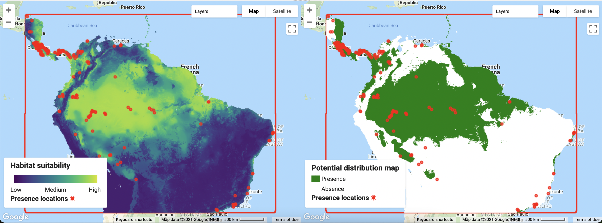

> It is important to understand that GEE does a resampling on the fly for displaying maps. The resolution of the model output will change with the zoom level. To set the visualization at the resolution of the analysis defined with the grain size, you need to specify the resolution of the image using the function `reproject()`.

In the next section we will calculate the Area Under the Curve of the Receiver Operator Characteristic (AUC-ROC)(Fielding and Bell, 1997) and the Area Under the Precision-Recall Curve (AUC-PR; Sofaer, Hoeting, & Jarnevich, 2019) for each run using the validation data sets. We will then calculate the mean AUC-ROC and AUC-PR for the **n** iterations.

It is important to check that you have a sufficient number of points for model validation at each run. Because the final number of points depend on the random split of spatial blocks, you want to make sure there are enough presence and pseudo-absence points for model validation. 

```{js, eval=F}
/////////////////////////////////////
// Section 7 - Accuracy assessment
/////////////////////////////////////

// Extract testing/validation data sets
var TestingDatasets = ee.List.sequence(3,ee.Number(numiter).multiply(4).subtract(1),4).map(function(x){
                      return results.get(x)});

// Double check that you have a satisfactory number of points for model validation
print('Number of presence and pseudo-absence points for model validation', ee.List.sequence(0,ee.Number(numiter).subtract(1),1)
.map(function(x){
  return ee.List([ee.FeatureCollection(TestingDatasets.get(x)).filter(ee.Filter.eq('PresAbs',1)).size(),
         ee.FeatureCollection(TestingDatasets.get(x)).filter(ee.Filter.eq('PresAbs',0)).size()]);
})
);

// Define functions to estimate sensitivity, specificity and precision at different thresholds.
function getAcc(img,TP){
  var Pr_Prob_Vals = img.sampleRegions({collection: TP, properties: ['PresAbs'], scale: GrainSize, tileScale: 16});
  var seq = ee.List.sequence({start: 0, end: 1, count: 25});
  return ee.FeatureCollection(seq.map(function(cutoff) {
  var Pres = Pr_Prob_Vals.filterMetadata('PresAbs','equals',1);
  // true-positive and true-positive rate, sensitivity  
  var TP =  ee.Number(Pres.filterMetadata('classification','greater_than',cutoff).size());
  var TPR = TP.divide(Pres.size());
  var Abs = Pr_Prob_Vals.filterMetadata('PresAbs','equals',0);
  // true-negative rate, specificity  
  var TNR = ee.Number(Abs.filterMetadata('classification','less_than',cutoff).size()).divide(Abs.size());
  // false-positive and false-positive rate
  var FP = ee.Number(Abs.filterMetadata('classification','greater_than',cutoff).size());
  var FPR = FP.divide(Abs.size());
  // precision
  var Precision = TP.divide(TP.add(FP));
  // sum of sensitivity and specificity
  var SUMSS = TPR.add(TNR);
  return ee.Feature(null,{cutoff: cutoff, TPR:TPR, FPR:FPR, Precision:Precision, SUMSS:SUMSS});
  }));
}

// Calculate AUC of the Receiver Operator Characteristic
function getAUCROC(x){
  var X = ee.Array(x.aggregate_array('FPR'));
  var Y = ee.Array(x.aggregate_array('TPR')); 
  var X1 = X.slice(0,1).subtract(X.slice(0,0,-1));
  var Y1 = Y.slice(0,1).add(Y.slice(0,0,-1));
  return X1.multiply(Y1).multiply(0.5).reduce('sum',[0]).abs().toList().get(0);
}

function AUCROCaccuracy(x){
  var HSM = ee.Image(images.get(x));
  var TData = ee.FeatureCollection(TestingDatasets.get(x));
  var Acc = getAcc(HSM, TData);
  return getAUCROC(Acc);
}


var AUCROCs = ee.List.sequence(0,ee.Number(numiter).subtract(1),1).map(AUCROCaccuracy);
print('AUC-ROC:', AUCROCs);
print('Mean AUC-ROC', AUCROCs.reduce(ee.Reducer.mean()));


// Calculate AUC of Precision Recall Curve
function getAUCPR(roc){
  var X = ee.Array(roc.aggregate_array('TPR'));
  var Y = ee.Array(roc.aggregate_array('Precision')); 
  var X1 = X.slice(0,1).subtract(X.slice(0,0,-1));
  var Y1 = Y.slice(0,1).add(Y.slice(0,0,-1));
  return X1.multiply(Y1).multiply(0.5).reduce('sum',[0]).abs().toList().get(0);
}

function AUCPRaccuracy(x){
  var HSM = ee.Image(images.get(x));
  var TData = ee.FeatureCollection(TestingDatasets.get(x));
  var Acc = getAcc(HSM, TData);
  return getAUCPR(Acc);
}

var AUCPRs = ee.List.sequence(0,ee.Number(numiter).subtract(1),1).map(AUCPRaccuracy);
print('AUC-PR:', AUCPRs);
print('Mean AUC-PR', AUCPRs.reduce(ee.Reducer.mean()));
```

Accuracy assessment results are:

Model | AUC-ROC | AUC-PR
------|-------|-------
Run 1 | 0.95 | 0.81
Run 2 | 0.79 | 0.73
Run 3 | 0.76 | 0.74
Run 4 | 0.96 | 0.94
Run 5 | 0.97 | 0.91
Run 6 | 0.97 | 0.77
Run 7 | 0.87 | 0.83
Run 8 | 0.97 | 0.92
Run 9 | 0.94 | 0.83
Run 10 | 0.84 | 0.80
**Mean**| **0.90** | **0.83**


In the next section we can generate a binary map from the habitat suitability model using the mean of the thresholds that maximized the sum of sensitivity (correct predictions of the occurrence) and specificity (correct predictions of the absence) for each of the individual model runs. This threshold has been shown to perform well with presence-only data (Liu, Newell, & White, 2016). This operation is more computationally demanding and is likely to give a memory limit error if trying to add the resulting binary image directly to the interactive map. If memory limits are reached, it is then necessary to use the batch mode on GEE, directly exporting the output to Google Drive or Google Storage.

```{js, eval=F}
////////////////////////////////////////////////////////////////////////////////
// Section 8 - Create a custom binary distribution map based on best threshold
////////////////////////////////////////////////////////////////////////////////

// Calculating the potential distribution map based on the threshold 
// that maximizes the sum of sensitivity and specificity is computationally intensive and
// for large number of iterations may need to be executed usingbatch mode.
// In batch mode, the final image needs to exported to Google Drive and opened in 
// another software for visualization (or imported to GEE as an asset for visualization.

// Function to extract theshold values
function getThreshold(x){
  var HSM = ee.Image(images.get(x));
  var TData = ee.FeatureCollection(TestingDatasets.get(x));
  var Acc = getAcc(HSM, TData);
  return Acc.sort({property:'SUMSS',ascending:false}).first().get("cutoff");
}

// Extract threshold values
var Thresholds = ee.List.sequence(0,ee.Number(numiter).subtract(1),1).map(getThreshold);
var MT = ee.Number(Thresholds.reduce(ee.Reducer.mean()));
print('Mean threshold:', MT);

// Transform probability model output into a binary map using the defined threshold and set NA into -9999
var DistributionMap2 = ModelAverage.gte(MT).unmask(-9999);

// Export final model to drive
Export.image.toDrive({
  image: DistributionMap2,
  description: 'BradypusPDistribution',
  scale: GrainSize,
  maxPixels: 1e10,
  region: AOI
});
```

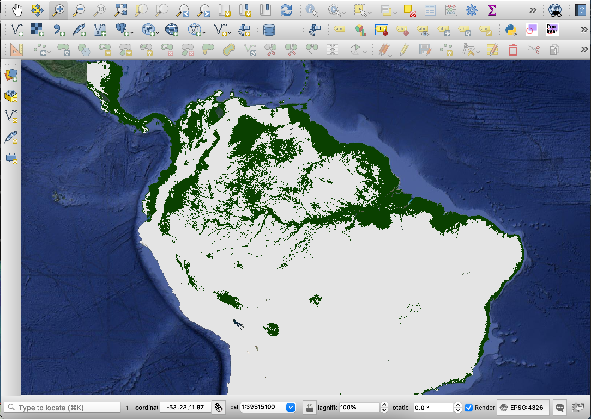

## Exporting results

There are different ways in which data can be exported in GEE. In the previous section we saw how to export the binary map to Google Drive. Next, we present code to export the final probability model as well as the training and validation data sets used for each model. Note that there are other options to export data in GEE (see the <https://developers.google.com/earth-engine/guides/exporting/>(user guide) for other ways to export data).


```{js, eval=F}
//////////////////////////////////////////////////////
// Section 9 - Export outputs
//////////////////////////////////////////////////////

// Export final model to drive

Export.image.toDrive({
  image: DistributionMap, //Object to export
  description: 'PotentialDistribution', //Name of the file
  scale: GrainSize, //Spatial resolution of the exported raster
  maxPixels: 1e10,
  region: AOI //Area of interest
});

Export.image.toDrive({
  image: ModelAverage, //Object to export
  description: 'HSI', //Name of the file
  scale: GrainSize, //Spatial resolution of the exported raster
  maxPixels: 1e10,
  region: AOI //Area of interest
});

// Export Accuracy Assessment Metrics
Export.table.toDrive({
  collection: ee.FeatureCollection(AUCROCs
                        .map(function(element){
                        return ee.Feature(null,{AUCROC:element})})),
  description: 'AUCRO',
  fileFormat: 'CSV',
});

Export.table.toDrive({
  collection: ee.FeatureCollection(AUCPRs
                        .map(function(element){
                        return ee.Feature(null,{AUCPR:element})})),
  description: 'AUCPR',
  fileFormat: 'CSV',
});


// Export training and validation data sets

// Extract training datasets
var TrainingDatasets = ee.List.sequence(1,ee.Number(numiter).multiply(4).subtract(1),4).map(function(x){
  return results.get(x)});

// If you are interested in exporting any of the training or testing datasets used for modeling,
// you need to extract the feature collections from the SDM output list and export them.
// Here is an example for exporting the training and validation data sets from the first iteration. 
// For other iterations you need to change the number in the get function. In JavaScript the first element of the list is indexed by 0.

Export.table.toDrive({
  collection: TrainingDatasets.get(0),
  description: 'TestingDataRun1',
  fileFormat: 'CSV',
});

Export.table.toDrive({
  collection: TestingDatasets.get(0),
  description: 'TestingDataRun1',
  fileFormat: 'CSV',
});
/*
*/
```

***

# Case Study 2: Accounting for temporal resolution in species distribution models

One main limitation in many SDMs is the lack of consideration for temporal resolution when modeling habitat suitability and species distributions (Araújo et al., 2019). We used **Cebus capucinus** as an example to demonstrate a framework that takes advantage of GEE to match the observation date for each presence record to the raster image from a collection that is closest in time.  For example, we could extract the normalized difference vegetation index (NDVI) at an occurrence location from the satellite image that is closest in time to that species observation.

We obtained occurrence data from GBIF (GBIF.org (27 January 2021) https://doi.org/10.15468/dl.qus4ha). We retained only georeferenced records with a coordinate uncertainty < 250 m.

For this example we will model *Cebus capucinus* distribution in Panama and Costa Rica, where most occurrence records are. 

As a note, some authors consider the subspecies *Cebus capucinus imitator* and  *Cebus capucinus capucinus* two distinct species which distribution split in central Panama (Mittermeier et al., 2013). In this study, we consider *Cebus capucinus* as one taxon.

For this example, we will manually define a study area geometry encompassing the countries of Costa Rica and Panama.

```{js, eval=F}
////////////////////////////////////
// Section 1 - Species data and AOI
////////////////////////////////////

var Data = ee.FeatureCollection('users/ramirocrego84/CebusCapucinus');

var AOI = ee.Geometry.Polygon([
  [-86.25662272529605,6.799166493750054],
  [-77.15994303779605,6.799166493750054],
  [-77.15994303779605,11.171211677305884],
  [-86.25662272529605,11.171211677305884],
  [-86.25662272529605,6.799166493750054]
]);

print('Original data size:', Data.size());
var Data = Data.filter(ee.Filter.bounds(AOI));

// Add border of study area to the map
var outline = ee.Image().byte().paint({
  featureCollection: AOI, color: 1, width: 3});
Map.addLayer(outline, {palette: 'FF0000'}, "Study Area");

// Center map to the area of interest
Map.centerObject(AOI, 6); //Number indicates the zoom level
```

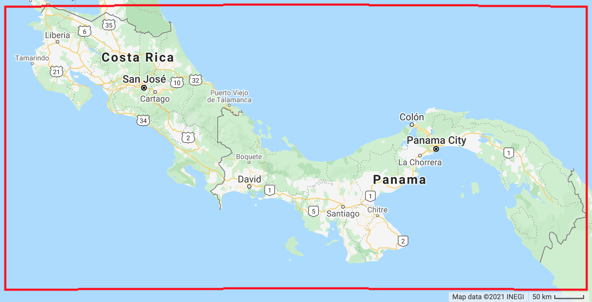

We will use data between 2003 and 2018 for model fitting, after filtering the data to retain a single record per year from each 250 m pixel. To do so, we need to run the `removeduplicate()` function for each year at the specified grain size and then merge filtered data from all years back together.


```{js, eval=F}
//////////////////////////////////////////////////////////////
// Section 2 - Define spatial resolution and remove duplicates
//////////////////////////////////////////////////////////////

// Define spatial resolution to work with (m)
var GrainSize = 250;

function RemoveDuplicates(data){
  var randomraster = ee.Image.random().reproject('EPSG:4326', null, GrainSize);
  var randpointvals = randomraster.sampleRegions({collection:ee.FeatureCollection(data), scale: 10, geometries: true});
  return randpointvals.distinct('random');
}

// Filter by year and eliminate points withing the same pixel at each year
var Data03 = RemoveDuplicates(Data.filter(ee.Filter.rangeContains('Date', '2003-01-01', '2003-12-31')));
var Data04 = RemoveDuplicates(Data.filter(ee.Filter.rangeContains('Date', '2004-01-01', '2004-12-31')));
var Data05 = RemoveDuplicates(Data.filter(ee.Filter.rangeContains('Date', '2005-01-01', '2005-12-31')));
var Data06 = RemoveDuplicates(Data.filter(ee.Filter.rangeContains('Date', '2006-01-01', '2006-12-31')));
var Data07 = RemoveDuplicates(Data.filter(ee.Filter.rangeContains('Date', '2007-01-01', '2007-12-31')));
var Data08 = RemoveDuplicates(Data.filter(ee.Filter.rangeContains('Date', '2008-01-01', '2008-12-31')));
var Data09 = RemoveDuplicates(Data.filter(ee.Filter.rangeContains('Date', '2009-01-01', '2009-12-31')));
var Data10 = RemoveDuplicates(Data.filter(ee.Filter.rangeContains('Date', '2010-01-01', '2010-12-31')));
var Data11 = RemoveDuplicates(Data.filter(ee.Filter.rangeContains('Date', '2011-01-01', '2011-12-31')));
var Data12 = RemoveDuplicates(Data.filter(ee.Filter.rangeContains('Date', '2012-01-01', '2012-12-31')));
var Data13 = RemoveDuplicates(Data.filter(ee.Filter.rangeContains('Date', '2013-01-01', '2013-12-31')));
var Data14 = RemoveDuplicates(Data.filter(ee.Filter.rangeContains('Date', '2014-01-01', '2014-12-31')));
var Data15 = RemoveDuplicates(Data.filter(ee.Filter.rangeContains('Date', '2015-01-01', '2015-12-31')));
var Data16 = RemoveDuplicates(Data.filter(ee.Filter.rangeContains('Date', '2016-01-01', '2016-12-31')));
var Data17 = RemoveDuplicates(Data.filter(ee.Filter.rangeContains('Date', '2017-01-01', '2017-12-31')));
var Data18 = RemoveDuplicates(Data.filter(ee.Filter.rangeContains('Date', '2018-01-01', '2018-12-31')));

// Combine all datasets
var Data2 = Data03.merge(Data04).merge(Data05).merge(Data06).merge(Data07)
            .merge(Data08).merge(Data09).merge(Data10).merge(Data11).merge(Data12)
            .merge(Data13).merge(Data14).merge(Data15).merge(Data16).merge(Data17).merge(Data18);
```

We will use mean annual temperature, annual precipitation (Hijmans et al. 2005), elevation (Farr et al. 2007) and percentage tree cover (Terra MODIS VCF, 250 m resolution) as predictor variables. We set the grain size of the analysis at 250 m resolution to match the MODIS data. 

```{js, eval=F}
//////////////////////////////////////////////
// Section 3 - Selecting Predictor Variables
//////////////////////////////////////////////

// Load bioclimatic data set
var BIO = ee.Image("WORLDCLIM/V1/BIO");

// Load elevation data 
var Elevation = ee.Image("USGS/SRTMGL1_003");

// Combine bands into a single image
var predictors = BIO.addBands(Elevation);

// Load MODIS surface reflectance
var start = ee.Date('2003-01-01');
var end = ee.Date('2020-01-01');
var MODIS = ee.ImageCollection("MODIS/006/MOD44B")
             .filterDate(start, end);

// Mask ocean from predictor variables
var watermask =  Elevation.gt(0); //Create a water mask
var predictors = predictors.updateMask(watermask).clip(AOI);
var bands = ['bio01','bio12','elevation','Percent_Tree_Cover'];

Map.addLayer(predictors, {bands:['elevation'], min: 0, max: 5000,  palette: ['000000','006600', '009900','33CC00','996600','CC9900','CC9966','FFFFFF',]}, 'Elevation (m)', 0);
Map.addLayer(MODIS.first(), {bands:['Percent_Tree_Cover'], min: 0, max: 100, palette:'white,yellow,green'}, 'Percent_Tree_Cover', 0); 
```

For each data location, we need to identify the closest recorded MODIS image in time and extract the percentage tree cover value. We need to define a series of function to do this. In this case, because the data product is produced yearly, we define a max difference of 360 days.

```{js, eval=F}
/////////////////////////////////////////////////////////////////////////////////
// Section 4 - Match each point to the closest image in time and extract the pixel value
/////////////////////////////////////////////////////////////////////////////////

// Function to add property with time in milliseconds to the data
var add_date = function(feature) {
  return feature.set({date_millis: ee.Date(ee.String(feature.get("Date"))).millis()});
};
var Data2 = Data2.map(add_date);

// Join Image and Points based on a maxDifference Filter within a day
var tempwin = 360;  // set time window (days)

var maxDiffFilter = ee.Filter.maxDifference({
  difference: tempwin * 24 * 60 * 60 * 1000,  // 8 day * hr * min * sec * milliseconds
  leftField: 'date_millis', //date data was collected
  rightField: 'system:time_start' // image date
});

// Define the join.
var saveBestJoin = ee.Join.saveBest({
  matchKey: 'bestImage',
  measureKey: 'timeDiff'
});

// Apply the join
var Data_match = saveBestJoin.apply(Data2, MODIS, maxDiffFilter);
//print(Data_match.limit(2)) //Activate to visualize results

// Function to add property with Percent Tree Cover value from the matched MODIS image
var add_value = function(feature) {
   var img1 = ee.Image(feature.get('bestImage')).select('Percent_Tree_Cover');
   var point = feature.geometry();
   var pixel_Value = img1.sample({region: point, scale: 10, tileScale: 15, dropNulls: false});
   return feature.set({Percent_Tree_Cover: pixel_Value.first().get('Percent_Tree_Cover')});
};

var DataFinal = Data_match.map(add_value);

// Remove points that were outside the MODIS image footprint (e.g., in the ocean)
var DataFinal = DataFinal.filter(ee.Filter.neq('Percent_Tree_Cover', null))

// Check the final number of presence locations for analysis
print('Presence data size:', DataFinal.size());
//print(DataFinal.limit(2)) //Activate to visualize results
Map.addLayer(DataFinal, {color:'red'}, 'Presence', 1)  //Add points to the map
```


After all this process, we end up with 330 occurrence records.

The next step is to define an area to create pseudo-absences. We will first create an image where presence records are marked to avoid creating pseudo-absences in the same locations where we have known presences.

```{js, eval=F}
///////////////////////////////////////////////////////////////////
// Section 5 - Defining area for creation of pseudo-absence points
///////////////////////////////////////////////////////////////////

// Make an image out of the presence locations to mask from the area to generate pseudo-absences. This will impede having presence and pseudo-absences in a 1km around the presence location.
var mask = DataFinal
  .reduceToImage({
    properties: ['random'],
    reducer: ee.Reducer.first()
}).reproject('EPSG:4326', null, ee.Number(1000));

var AreaForPA = mask.mask().updateMask(watermask).clip(AOI);
Map.addLayer(AreaForPA)
```

To create a matching pseudo-absence location for each occurrence location, we generated a random pseudo-absence point within a 100 km buffer, extracting the percent tree cover from the VCF image that corresponded to the time period of the occurrence point. We repeated this process five times, resulting in five balanced datasets for each iteration, each with a different set of pseudo-absences. 

To do this we defined a function that creates a random point within a 100 km buffer and extracts the pixel value of the percent tree cover image. We then merge the presence data with the pseudo-absences. Finally, we extract the value for the other predictors, elevation, mean annual temperature, annual precipitation. Each of the 5 resulting training data sets is used to fit a random forest classifier.

We pack all this into a function that we can map across a list of random seeds for each iteration of model fitting and validation.

```{js, eval=F}
///////////////////////////
// Section 6 - Model fit
///////////////////////////

// Define SDM function
function SDM(x) {
    // Presence points
    var PresencePoints = DataFinal.map(function(feature){return feature.set('PresAbs', 1)});
    var PresencePoints = predictors.sampleRegions({collection: PresencePoints, properties: ['PresAbs', 'Percent_Tree_Cover'], scale: 250, tileScale: 4});
    var npoints = PresencePoints.size();
    
    // Pseudoabsences
    var PseudoAbs = DataFinal.map(function(feature){
                        var img1 = ee.Image(feature.get('bestImage')).select('Percent_Tree_Cover');
                        var pointbuff = feature.geometry().buffer(100000);
                        var randpoints = AreaForPA.sample({region: pointbuff, scale: 10, numPixels: 30, seed:x, geometries: true, tileScale: 15, dropNulls: true}); // If error appears on drop null, increase the number of pixels
                        var PTC = img1.sampleRegions({collection: randpoints, scale: 10, tileScale: 16, geometries: true});
                        return PTC.first();
                      });
    var PseudoAbs = PseudoAbs.map(function(feature){return feature.set('PresAbs', 0)});
    var PseudoAbsPoints = predictors.sampleRegions({collection: PseudoAbs, properties: ['PresAbs', 'Percent_Tree_Cover'], scale: 250, tileScale: 4, geometries: true});

    // Merge points
    var trainingData = PresencePoints.merge(PseudoAbsPoints);

    // Classify using Random Forest
    var rfClassifier = ee.Classifier.smileRandomForest(500).setOutputMode('PROBABILITY').train(trainingData, 'PresAbs', bands); 
   
    return ee.List([rfClassifier, trainingData]);
}
```

We can now fit the models. We use a pre-defined list of random numbers for reproducibility of results.

```{js, eval=F}
// Define number of repetitions
var numiter = 5;

// Fit SDM
var results = ee.List([81,96,57,22,2]).map(SDM);

// Extract results from list
var results = results.flatten();
//print(results) //Activate this line to visualize all elements

```

> In this example we are using 5 iterations. Adding more iterations could cause a memory limit issue. If more iterations are desired, then instead of adding resulting predictions to the interactive map, you can directly export results to Google Drive (batch mode) to prevent the computation from reaching the memory limit. 

Because model predictions will vary each year due to changes in underlying predictor variables, we withheld data from 2019 for model validation. We use 2019 for out-of-sample model validation as this year had a large number of occurrence records and was the last year the MODIS VCF was available in GEE. We assume that if the model predicts well for withheld data in 2019, then the model likely performed well in other years and is useful for making predictions and studying change over time. We used 125 occurrence records and a set of 125 pseudo-absences randomly created across the study area (within a 100 km buffer around each occurrence location) to estimate the AUC-RP for each of the five individual model predictions using the percentage of tree cover for 2019, together with mean annual temperature, annual precipitation and elevation as the predictor variables.

We need to define the AUC-RP functions as we did in the previous example.

```{js, eval=F}
////////////////////////////////////
// Section 7 - Accuracy assessment
////////////////////////////////////

// Define functions to estimate sensitivity, specificity and precision.
function getAcc(img,TP){
  var Pr_Prob_Vals = img.sampleRegions({collection: TP, properties: ['PresAbs'], scale: GrainSize, tileScale: 16});
  var seq = ee.List.sequence({start: 0, end: 1, count: 25});
  return ee.FeatureCollection(seq.map(function(cutoff) {
  var Pres = Pr_Prob_Vals.filterMetadata('PresAbs','equals',1);
  // true-positive and true-positive rate, sensitivity  
  var TP =  ee.Number(Pres.filterMetadata('classification','greater_than',cutoff).size());
  var TPR = TP.divide(Pres.size());
  var Abs = Pr_Prob_Vals.filterMetadata('PresAbs','equals',0);
  // true-negative rate, specificity  
  var TNR = ee.Number(Abs.filterMetadata('classification','less_than',cutoff).size()).divide(Abs.size());
  // false-positive and false-positive rate
  var FP = ee.Number(Abs.filterMetadata('classification','greater_than',cutoff).size());
  var FPR = FP.divide(Abs.size());
  // precision
  var Precision = TP.divide(TP.add(FP));
  return ee.Feature(null,{TPR:TPR, FPR:FPR, Precision:Precision});
  }));
}

// Calculate AUC of Precision Recall Curve
function getAUCPR(x){
  var X = ee.Array(x.aggregate_array('TPR'));
  var Y = ee.Array(x.aggregate_array('Precision')); 
  var X1 = X.slice(0,1).subtract(X.slice(0,0,-1));
  var Y1 = Y.slice(0,1).add(Y.slice(0,0,-1));
  return X1.multiply(Y1).multiply(0.5).reduce('sum',[0]).abs().toList().get(0);
}

// Extract all model classifiers
var classifiers = ee.List.sequence(0,ee.Number(numiter).multiply(2).subtract(1),2)
                  .map(function(x){return results.get(x)});
                  
// We will use 2019 data to validate the model
var Data19 = RemoveDuplicates(Data.filter(ee.Filter.rangeContains('Date', '2019-01-01', '2019-12-31')));
var Presence19 = Data19.map(function(feature){return feature.set('PresAbs', 1)});
Map.addLayer(Presence19, {color:'red'}, 'Presence 2019', 1)  //Add points to the map

// Make an image out of the presence locations to mask from the area to generate pseudoabsences. This will impede having presence and pseudoabsences near the same pixel.
var mask2 = Presence19
  .reduceToImage({
    properties: ['random'],
    reducer: ee.Reducer.first()
}).reproject('EPSG:4326', null, ee.Number(1000));

// Limit pseudo-absences to a buffer around presence points. 
var buffer = 100000; // E.g., 100 km.
var AreaForPA2 = Data19.geometry().buffer(buffer);
var AreaForPA2 = mask2.mask().clip(AreaForPA2).updateMask(watermask).clip(AOI);

// Create random pseudo-absences
var Abs19 = AreaForPA2.sample({region: AOI, scale: GrainSize, numPixels: 1000, geometries: true}); //Because many points will on the ocean, we need to create more than needed.
var Abs19 = Abs19.randomColumn().sort('random').limit(Presence19.size()); // We keep the same amount of pseudoabsences than presences
var Abs19 = Abs19.map(function(feature){
    return feature.set('PresAbs', 0);
    });
print('Presence 2019', Presence19.size());
print('Pseudo-absences 2019', Abs19.size());

// Merge presence and pseudo-absences
var testingdata2019 = Presence19.merge(Abs19);

// Create the predictor variables for 2019
var mod2019 = MODIS.filterDate('2019-01-01', '2019-12-31').select(['Percent_Tree_Cover']).first();
var pred19 = predictors.addBands(mod2019);

// Predict HSI for 2019 and estimate ROC-AUC
function accuracy(x){
  var Classifier = classifiers.get(x);
  var HSM = pred19.classify(Classifier);
  var Acc = getAcc(HSM, testingdata2019);
  return getAUCPR(Acc);
}

var AUCPRs = ee.List.sequence(0,ee.Number(numiter).subtract(1),1).map(accuracy);
print('AUC of the precision-recall:', AUCPRs);
print('Mean AUC of the precision-recall', AUCPRs.reduce(ee.Reducer.mean()));
```

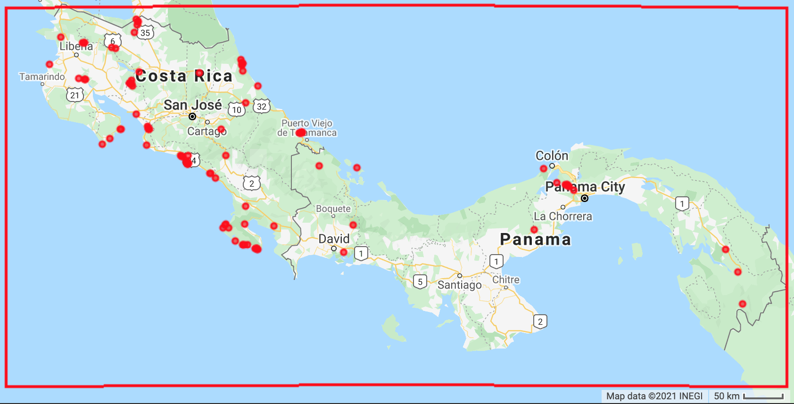

---

The individual model accuracy is:

Model | Random Forest AUC-PR
------|-------|-------
Run 1 | 0.89 
Run 2 | 0.81
Run 3 | 0.78
Run 4 | 0.80
Run 5 | 0.72
**Mean**| **0.80** |

After validating our models, we can predict suitable habitat across all years to reflect changes over time in the Terra MODIS VCF image composite. We need to define a function that adds the Terra MODIS VCF of each year to the mean annual temperature, annual precipitation and elevations variables and predicts the habitat suitability for each single model. We then obtain the median habitat suitability per pixel as the final prediction.

```{js, eval=F}
///////////////////////////
// Section 8 - Predictions
///////////////////////////

var PTC = ee.ImageCollection("MODIS/006/MOD44B").select(['Percent_Tree_Cover']);
var HSI = PTC.map(function(img){
  var predimg = predictors.addBands(img); 
  return ee.ImageCollection.fromImages(ee.List.sequence(0,ee.Number(numiter).subtract(1),1)
  .map(function prediction(x){
        var Classifier = classifiers.get(x);
        return predimg.classify(Classifier)}))
  .mean().copyProperties(img, ['system:time_start']);
  });

//print(HSI);
```

We can plot some outputs. We need to convert the resulting image collection into a list to display each year. Here we display years 2000 and 2019.

```{js, eval=F}
// Define visualization parameters.
var visParams = {
  min: 0,
  max: 0.9,
  palette: ["#440154FF","#482677FF","#404788FF","#33638DFF","#287D8EFF",
  "#1F968BFF","#29AF7FFF","#55C667FF","#95D840FF","#DCE319FF"],
};

var HSIlist = HSI.toList(20);

// Add final habitat suitability layer to the map. Use the function get to select specific years. 0 is the first element in the list.
Map.addLayer(ee.Image(HSIlist.get(0)), visParams, 'Habitat Suitability - 2000');
Map.addLayer(ee.Image(HSIlist.get(19)), visParams, 'Habitat Suitability - 2019');

// Create legend for habitat suitability map.
var legend = ui.Panel({style: {position: 'bottom-left', padding: '8px 15px'}});

legend.add(ui.Label({
  value: "Habitat suitability",
  style: {fontWeight: 'bold', fontSize: '18px', margin: '0 0 4px 0', padding: '0px'}
}));

var colors = ["#DCE319FF","#287D8EFF","#440154FF"];
var names = ['High', 'Medium','Low'];
var entry;
for (var x = 0; x<3; x++){
  entry = [
    ui.Label({style:{color:colors[x],margin: '0 0 4px 0'}, value:'██'}),
    ui.Label({value: names[x],style: {margin: '0 0 4px 4px'}})
  ];
  legend.add(ui.Panel(entry, ui.Panel.Layout.Flow('horizontal')));
}
```

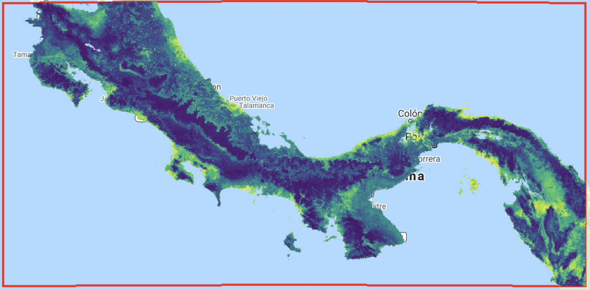

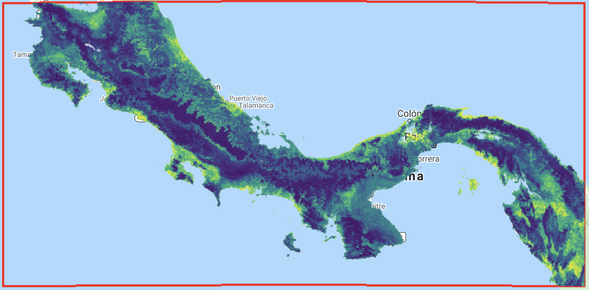

To assess habitat suitability change across time, we fit a pixel-based linear regression. We applied the `formaTrend()` function to the image collection containing habitat suitability predictions for each year of our 20-year study. This function fits a pixel-based linear regression to identify areas where habitat suitability increased or decreased across the 20-year period. The product is an image with four bands, two of which are of our interest, 1) the slope of the linear regression and 2) a t-test statistic on the significance of the slope. Finally, we create an output map showing the slope of the linear regression at each pixel while using the t-test statistic to mask out any pixels with non-significant trends. Positive values indicate areas that increased in habitat suitability over time and negative values indicate areas that decreased in habitat suitability.

```{js, eval=F}
////////////////////////////////////////////////////////////////////////////
// Section 9 - Fit linear regression to 20 years of HSI values at each pixel
////////////////////////////////////////////////////////////////////////////

// Use the formaTrend function to fit a linear regression to the habitat suitability collection.
var TempTrend = HSI.formaTrend();
//print(TempTrend);

// Display pixels with significative trends at an alpha = 0.05.
// To mask out pixels with non-significative trends, we need to find those pixels with 
// a two tailed t-test statistic larger or lower than the threshold value for the specific degrees of freedom.
// In our case we have 20 years, so 19 degrees of freedom, at an alpha of 0.05.  This gives us critical values for the t-test statistic of 2.093 and -2.093

var negative = TempTrend.select('long-tstat').lt(-2.093);
var possitive = TempTrend.select('long-tstat').gt(2.093);
var sign = negative.add(possitive);

Map.addLayer(TempTrend.select('long-trend').updateMask(sign), {
  min: -0.02,
  max: 0.02,
  palette: ['ff0000','e96666','d6aeae','f1f1f1','c8ccff','6e8dff','000dad']
}, 'HSI long-trend');

// Add regression slope legend to the map
legend.add(ui.Label({
  value: "Regression slope",
  style: {fontWeight: 'bold', fontSize: '18px', margin: '0 0 4px 0', padding: '0px'}
}));

var colors = ['ff0000','f1f1f1','000dad'];
var names = ['-0.02', '0','0.02'];
var entry;
for (var x = 0; x<3; x++){
  entry = [
    ui.Label({style:{color:colors[x],margin: '0 0 4px 0'}, value:'██'}),
    ui.Label({value: names[x],style: {margin: '0 0 4px 4px'}})
  ];
  legend.add(ui.Panel(entry, ui.Panel.Layout.Flow('horizontal')));
}

Map.add(legend);
```


It is also possible to create a gif animation showing the change of habitat suitability across years.

```{js, eval=F}
// Create RGB visualization images for use as animation frames.
var rgbVis = HSM.map(function(img) {
  var scale = 250;
  return img.visualize(visParams);
});

// Define GIF visualization parameters.
var gifParams = {
  'region': geometry2,
  'dimensions': 500,
  'crs': 'EPSG:3857',
  'framesPerSecond': 2
};

//Print the GIF URL to the console.
print(rgbVis.getVideoThumbURL(gifParams));
```

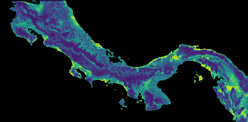

As before, we can export results to Google Drive.

```{js, eval=F}
//////////////////////////////////////////////////////
// Section 10 - Export final map
//////////////////////////////////////////////////////

// Export final model to drive
Export.image.toDrive({
   image: TempTrend, //Image to export
   description: 'Cebuscapucinus', //File name
   scale: GrainSize, // Spatial resolution
   maxPixels: 1e10,
   region: AOI //Area of interest
 });
```


# Case Study 3: 


# Code to model presence-absence data

Using presence and absence data is always recommended for SDM analysis.

Here we present code that will allow you to fit an SDM using presence and absence data. Because there is no need to create pseudo-absences, the code has some modifications from the previous examples. However, the work flow is very similar. 

It is important that the data set that is uploaded into GEE as an asset contains a field with 1 indicating presence and 0 indicating absence for each location. 


```{js, eval=F}
// Presence absence model

///////////////////////////////
// Section 1 - Species data
///////////////////////////////

// Load presence absence data
//var Data = ee.FeatureCollection('users/yourdata');
var Data = table
print('Data size:', Data.size());

// Define spatial resolution to work with (m)
var GrainSize = 1000;


// Add two maps to the screen.
var left = ui.Map();
var right = ui.Map();
ui.root.clear();
ui.root.add(left);
ui.root.add(right);

// Link maps, so when you drag one map, the other will be moved in sync.
ui.Map.Linker([left, right], 'change-bounds');

// Add presence points to the map
// Visualize presence points on the map
//right.addLayer(Data, {color:'red'}, 'Data', 1);
//left.addLayer(Data, {color:'red'}, 'Data', 1);

////////////////////////////////////////
// Section 2 - Define Area of Interest
////////////////////////////////////////

// Define the AOI
var AOI = Data.geometry().bounds().buffer(10000);

// Add border of study area to the map
var outline = ee.Image().byte().paint({
  featureCollection: AOI, color: 1, width: 3});
right.addLayer(outline, {palette: 'FF0000'}, "Study Area");
left.addLayer(outline, {palette: 'FF0000'}, "Study Area");

// Center map to the area of interest
right.centerObject(AOI, 9); //Number indicates the zoom level
left.centerObject(AOI, 9); //Number indicates the zoom level


//////////////////////////////////////////////
// Section 3 - Selecting Predictor Variables
//////////////////////////////////////////////

// Here as an example we are using elevation data.
// Load elevation data from the data catalog and calculate slope, aspect, and a simple hillshade from the terrain Digital Elevation Model.
var Terrain = ee.Algorithms.Terrain(ee.Image("USGS/SRTMGL1_003"));
var Terrain = Terrain.select(['elevation','slope','aspect']); // Select elevation, slope and aspect

// Load NDVI 250 m collection and estimate median value per pixel
var MODIS = ee.ImageCollection("MODIS/006/MOD13Q1");
var MedianNDVI = MODIS.filterDate('2003-01-01', '2020-12-31').select(['NDVI']).median();

// Combine bands into a single image
var predictors = Terrain.addBands(MedianNDVI).clip(AOI);

// Mask ocean from predictor variables
var watermask =  Terrain.select('elevation').gt(0); //Create a water mask
var predictors = predictors.updateMask(watermask).clip(AOI);

left.addLayer(predictors.clip(AOI), {bands:['elevation'], min: 900, max: 1700,  palette: ['000000','006600', '009900','33CC00','996600','CC9900','CC9966','FFFFFF',]}, 'Elevation (m)', 0);
left.addLayer(predictors.clip(AOI), {bands:['slope'], min: 0, max: 45, palette:'white,red'}, 'Slope (Degrees)', 0); 
left.addLayer(predictors.clip(AOI), {bands:['aspect'], min: 0, max: 350, palette:'red,blue'}, 'Aspect (Degrees)', 0); 

// Estimate correlation among predictor variables

// Extract local covariate values from multiband predictor image at training points
var DataCor = predictors.sample({scale: GrainSize, numPixels: 5000, geometries: true}); //Generate 5000 random points
var PixelVals = predictors.sampleRegions({collection: DataCor, scale: GrainSize, tileScale: 16}); //Extract covariate values

// To check all pairwise correlations we need to map the reduceColumns function across all pairwise combinations of predictors
var CorrAll = predictors.bandNames().map(function(i){
    var tmp1 = predictors.bandNames().map(function(j){
      var tmp2 = PixelVals.reduceColumns({
        reducer: ee.Reducer.spearmansCorrelation(),
        selectors: [i, j]
      });
    return tmp2.get('correlation');
    });
    return tmp1;
  });
print('Variables correlation matrix',CorrAll);

// Select bands for modeling
var bands = ['elevation','slope','aspect','NDVI'];
var predictors = predictors.select(bands);

///////////////////////////////////////////////////////////////////////////////////////////////////////////////////////////////////
// Section 4 - Defining blocks blocks to fold randomly for cross validation
///////////////////////////////////////////////////////////////////////////////////////////////////////////////////////////////////

// Make an image out of the presence locations to mask from the area to generate pseudo-absences.
// This will impede having presence and pseudo-absences in an area twice the defined grain size.
var mask = Data
  .reduceToImage({
    properties: ['random'],
    reducer: ee.Reducer.first()
}).reproject('EPSG:4326', null, ee.Number(GrainSize));

var AreaForPA = mask.mask().updateMask(watermask).clip(AOI); //Activate this line for using the entire AOI for generating random points

// Define a function to create a grid over AOI
function makeGrid(geometry, scale) {
  // pixelLonLat returns an image with each pixel labeled with longitude and
  // latitude values.
  var lonLat = ee.Image.pixelLonLat();
  // Select the longitude and latitude bands, multiply by a large number then
  // truncate them to integers.
  var lonGrid = lonLat
    .select('longitude')
    .multiply(100000)
    .toInt();
  var latGrid = lonLat
    .select('latitude')
    .multiply(100000)
    .toInt();
  return lonGrid
    .multiply(latGrid)
    .reduceToVectors({
      geometry: geometry.buffer(100, 1000), //Buffer to expand grid and include borders
      scale: scale,
      geometryType: 'polygon',
    });
}
// Create grid and remove cells outside AOI
var Scale = 5000; // Set range in m to create spatial blocks
var grid = makeGrid(AOI, Scale);
var Grid = watermask.reduceRegions({collection: grid, reducer: ee.Reducer.mean()}).filter(ee.Filter.neq('mean',null));
right.addLayer(Grid, {},'Grid for spatail block cross validation', 0);


//////////////////////////////////////
// Section 5 - Fitting SDM models
//////////////////////////////////////

// Define function to generate a vector of random numbers between 1 and 1000
function runif(length) {
    return Array.apply(null, Array(length)).map(function() {
        return Math.round(Math.random() * (1000 - 1) + 1);
    });
}

// Define SDM function
// Activate the desired classifier, Random Forest or Gradient Boosting. 
// Note that other algorithms are available in GEE. See ee.Classifiers on the documentation for more information.

function SDM(x) {
    var Seed = ee.Number(x);
    
    // Randomly split blocks for training and validation
    var GRID = ee.FeatureCollection(Grid).randomColumn({seed:Seed}).sort('random');
    var TrainingGrid = GRID.filter(ee.Filter.lt('random', split));  // Filter points with 'random' property < split percentage
    var TestingGrid = GRID.filter(ee.Filter.gte('random', split));  // Filter points with 'random' property >= split percentage

    // Presence
    var PresencePoints = ee.FeatureCollection(Data).filter(ee.Filter.eq('PresAbs',1)); //Filter all presence points
    var TrPresencePoints = PresencePoints.filter(ee.Filter.bounds(TrainingGrid));  // Filter points with 'random' property < split percentage
    var TePresencePoints = PresencePoints.filter(ee.Filter.bounds(TestingGrid));  // Filter points with 'random' property >= split percentage

    //Absence   
    var AbsPoints = ee.FeatureCollection(Data).filter(ee.Filter.eq('PresAbs',0)); //Filter all absence points
    var TrAbsencePoints = AbsPoints.filter(ee.Filter.bounds(TrainingGrid));  // Filter points with 'random' property < split percentage
    var TeAbsencePoints = AbsPoints.filter(ee.Filter.bounds(TestingGrid));  // Filter points with 'random' property >= split percentage

    // Merge points
    var trainingPartition = TrPresencePoints.merge(TrAbsencePoints);
    var testingPartition = TePresencePoints.merge(TeAbsencePoints);
    
    // Extract local covariate values from multiband predictor image at training points
    var trainPixelVals = predictors.sampleRegions({collection: trainingPartition, properties: ['PresAbs'], scale: GrainSize, tileScale: 16});

    // Classify using random forest 
    var Classifier = ee.Classifier.smileRandomForest({
       numberOfTrees: 500, //The number of decision trees to create.
       variablesPerSplit: null, //The number of variables per split. If unspecified, uses the square root of the number of variables.
       minLeafPopulation: 10,//Only create nodes whose training set contains at least this many points. Integer, default: 1
       bagFraction: 0.5,//The fraction of input to bag per tree. Default: 0.5.
       maxNodes: null,//The maximum number of leaf nodes in each tree. If unspecified, defaults to no limit.
       seed: Seed//The randomization seed.
      });
    
    // Classify using gradient boosting 
    // var ClassifierPr = ee.Classifier.smileGradientTreeBoost({
    //   numberOfTrees:500, //The number of decision trees to create.
    //   shrinkage: 0.005, //The shrinkage parameter in (0, 1) controls the learning rate of procedure. Default: 0.005
    //   samplingRate: 0.7, //The sampling rate for stochastic tree boosting. Default 0.07
    //   maxNodes: null, //The maximum number of leaf nodes in each tree. If unspecified, defaults to no limit.
    //   loss: "LeastAbsoluteDeviation", //Loss function for regression. One of: LeastSquares, LeastAbsoluteDeviation, Huber.
    //   seed:Seed //The randomization seed.
    // });
  
    // Presence probability 
    var ClassifierPr = Classifier.setOutputMode('PROBABILITY').train(trainPixelVals, 'PresAbs', bands); 
    var ClassifiedImgPr = predictors.select(bands).classify(ClassifierPr);
    
    // Binary presence/absence map
    var ClassifierBin = Classifier.setOutputMode('CLASSIFICATION').train(trainPixelVals, 'PresAbs', bands); 
    var ClassifiedImgBin = predictors.select(bands).classify(ClassifierBin);
   
    return ee.List([ClassifiedImgPr, ClassifiedImgBin, trainingPartition, testingPartition]);
  
}


// Define partition for training and testing data
var split = 0.70;  // The proportion of the blocks used to select training data

// Define number of repetitions
var numiter = 10;

// Fit SDM 
// Create random seeds
var RanSeeds = runif(numiter);
var results = ee.List(RanSeeds).map(SDM);
// Extract results from list
var results = results.flatten();
//print(results); //Activate this line to visualize all elements

////////////////////////////////////////////////////////////////////
// Section 6 - Extracting and displaying model prediction results
////////////////////////////////////////////////////////////////////

// Habitat suitability

// Set visualization parameters
var visParams = {
  min: 0,
  max: 0.8,
  palette: ["#440154FF","#482677FF","#404788FF","#33638DFF","#287D8EFF",
  "#1F968BFF","#29AF7FFF","#55C667FF","#95D840FF","#DCE319FF"],
};

// Extract all model predictions
var images = ee.List.sequence(0,ee.Number(numiter).multiply(4).subtract(1),4).map(function(x){
  return results.get(x)});

// You can add all the individual model predictions to the map. The number of layers to add will depend on how many iterations you selected.

// left.addLayer(ee.Image(images.get(0)), visParams, 'Run1');
// left.addLayer(ee.Image(image.get(1)), visParams, 'Run2');

// Calculate mean of all individual model runs
var ModelAverage = ee.ImageCollection.fromImages(images).mean();

// Add final habitat suitability layer and presence locations to the map
left.addLayer(ModelAverage, visParams, 'Habitat Suitability');
left.addLayer(Data, {color:'red'}, 'Presence', 1);

// Create legend for habitat suitability map.
var legend = ui.Panel({style: {position: 'bottom-left', padding: '8px 15px'}});

legend.add(ui.Label({
  value: "Habitat suitability",
  style: {fontWeight: 'bold', fontSize: '18px', margin: '0 0 4px 0', padding: '0px'}
}));

var colors = ["#DCE319FF","#287D8EFF","#440154FF"];
var names = ['High', 'Medium','Low'];
var entry;
for (var x = 0; x<3; x++){
  entry = [
    ui.Label({style:{color:colors[x],margin: '0 0 4px 0'}, value:'██'}),
    ui.Label({value: names[x],style: {margin: '0 0 4px 4px'}})
  ];
  legend.add(ui.Panel(entry, ui.Panel.Layout.Flow('horizontal')));
}

legend.add(ui.Panel(
  [ui.Label({value: "Presence locations",style: {fontWeight: 'bold', fontSize: '16px', margin: '0 0 4px 0'}}),
   ui.Label({style:{color:"red",margin: '0 0 0 4px'}, value:'◉'})],
  ui.Panel.Layout.Flow('horizontal')));

left.add(legend);


// Distribution map

// Extract all model predictions
var images2 = ee.List.sequence(1,ee.Number(numiter).multiply(4).subtract(1),4).map(function(x){
  return results.get(x)});

// Calculate mean of all indivudual model runs
var DistributionMap = ee.ImageCollection.fromImages(images2).mode();

// Add final distribution map and presence locations to the map
right.addLayer(DistributionMap, 
  {palette: ["white", "green"], min: 0, max: 1}, 
  'Potential distribution');
right.addLayer(Data, {color:'red'}, 'Presence', 1);

// Create legend for distribution map
var legend2 = ui.Panel({style: {position: 'bottom-left',padding: '8px 15px'}});
legend2.add(ui.Label({
  value: "Potential distribution map",
  style: {fontWeight: 'bold',fontSize: '18px',margin: '0 0 4px 0',padding: '0px'}
}));

var colors2 = ["green","white"];
var names2 = ['Presence', 'Absence'];
var entry2;
for (var x = 0; x<2; x++){
  entry2 = [
    ui.Label({style:{color:colors2[x],margin: '0 0 4px 0'}, value:'██'}),
    ui.Label({value: names2[x],style: {margin: '0 0 4px 4px'}})
  ];
  legend2.add(ui.Panel(entry2, ui.Panel.Layout.Flow('horizontal')));
}

legend2.add(ui.Panel(
  [ui.Label({value: "Presence locations",style: {fontWeight: 'bold', fontSize: '16px', margin: '0 0 4px 0'}}),
   ui.Label({style:{color:"red",margin: '0 0 4px 4px'}, value:'◉'})],
  ui.Panel.Layout.Flow('horizontal')));

right.add(legend2);

/////////////////////////////////////////
// Section 7 - Accuracy assessment
/////////////////////////////////////////

// Extract testing/validation datasets
var TestingDatasets = ee.List.sequence(3,ee.Number(numiter).multiply(4).subtract(1),4).map(function(x){
                      return results.get(x)});

// Double check that you have a satisfactory number of points for model validation
print('Number of presence and absence points for model validation', ee.List.sequence(0,ee.Number(numiter).subtract(1),1)
.map(function(x){
  return ee.List([ee.FeatureCollection(TestingDatasets.get(x)).filter(ee.Filter.eq('PresAbs',1)).size(),
         ee.FeatureCollection(TestingDatasets.get(x)).filter(ee.Filter.eq('PresAbs',0)).size()]);
})
);

// Define functions to estimate, sensitivity, specificity and precision.
function getAcc(img,TP){
  var Pr_Prob_Vals = img.sampleRegions({collection: TP, properties: ['PresAbs'], scale: GrainSize, tileScale: 16});
  var seq = ee.List.sequence({start: 0, end: 1, count: 25});
  return ee.FeatureCollection(seq.map(function(cutoff) {
  var Pres = Pr_Prob_Vals.filterMetadata('PresAbs','equals',1);
  // true-positive and true-positive rate, sensitivity  
  var TP =  ee.Number(Pres.filterMetadata('classification','greater_than',cutoff).size());
  var TPR = TP.divide(Pres.size());
  var Abs = Pr_Prob_Vals.filterMetadata('PresAbs','equals',0);
  // true-negative rate, specificity  
  var TNR = ee.Number(Abs.filterMetadata('classification','less_than',cutoff).size()).divide(Abs.size());
  // false-positive and false-positive rate
  var FP = ee.Number(Abs.filterMetadata('classification','greater_than',cutoff).size());
  var FPR = FP.divide(Abs.size());
  // precision
  var Precision = TP.divide(TP.add(FP));
  // sum of sensitivity and specificity
  var SUMSS = TPR.add(TNR);
  return ee.Feature(null,{cutoff: cutoff, TPR:TPR, FPR:FPR, Precision:Precision, SUMSS:SUMSS});
  }));
}

// Calculate AUC of the Receiver Operator Characteristic
function getAUCROC(x){
  var X = ee.Array(x.aggregate_array('FPR'));
  var Y = ee.Array(x.aggregate_array('TPR')); 
  var X1 = X.slice(0,1).subtract(X.slice(0,0,-1));
  var Y1 = Y.slice(0,1).add(Y.slice(0,0,-1));
  return X1.multiply(Y1).multiply(0.5).reduce('sum',[0]).abs().toList().get(0);
}

function AUCROCaccuracy(x){
  var HSM = ee.Image(images.get(x));
  var TData = ee.FeatureCollection(TestingDatasets.get(x));
  var Acc = getAcc(HSM, TData);
  return getAUCROC(Acc);
}


var AUCROCs = ee.List.sequence(0,ee.Number(numiter).subtract(1),1).map(AUCROCaccuracy);
print('AUC-ROC:', AUCROCs);
print('Mean AUC-ROC', AUCROCs.reduce(ee.Reducer.mean()));

/////////////////////////////////////////////////////////////////////////////////
// Section 8 - Create a custom binary distribution map based on best threshold
/////////////////////////////////////////////////////////////////////////////////

// Calculating the potential distribution map based on the threshold 
// that maximizes the sum of sensitivity and specificity is computationally intensive and
// for large number of iterations may need to be executed using batch mode.
// In batch mode, the final image needs to exported to Google Drive and opened in 
// another software for visualization (or imported to GEE as an asset for visualization.

// Function to extract threshold values
function getThreshold(x){
  var HSM = ee.Image(images.get(x));
  var TData = ee.FeatureCollection(TestingDatasets.get(x));
  var Acc = getAcc(HSM, TData);
  return Acc.sort({property:'SUMSS',ascending:false}).first().get("cutoff");
}

// Extract threshold values
var Thresholds = ee.List.sequence(0,ee.Number(numiter).subtract(1),1).map(getThreshold);
var MT = ee.Number(Thresholds.reduce(ee.Reducer.mean()));
print('Mean threshold:', MT);

// Transform probability model output into a binary map using the defined threshold and set NA into -9999
var DistributionMap2 = ModelAverage.gte(MT).unmask(-9999);

// Export final model to drive
Export.image.toDrive({
  image: DistributionMap2,
  description: 'filename',
  scale: GrainSize,
  maxPixels: 1e10,
  region: AOI
});


///////////////////////////////////////
// Section 9 - Export outputs
///////////////////////////////////////

// Export final model to drive
/*
Export.image.toDrive({
  image: DistributionMap, //Object to export
  description: 'PotentialDistribution', //Name of the file
  scale: GrainSize, //Spatial resolution of the exported raster
  maxPixels: 1e10,
  region: AOI //Area of interest
});

Export.image.toDrive({
  image: ModelAverage, //Object to export
  description: 'HSI', //Name of the file
  scale: GrainSize, //Spatial resolution of the exported raster
  maxPixels: 1e10,
  region: AOI //Area of interest
});

// Export training and validation data sets

// Extract training datasets
var TrainingDatasets = ee.List.sequence(1,ee.Number(numiter).multiply(4).subtract(1),4).map(function(x){
  return results.get(x)});

// If you are interested in exporting any of the training or testing data sets used for modelling,
// you need to extract the feature collections from the list and export them.
// Here an example to export the trainign and validation data sets from the first iteration. 
// For other iterations you need to change the number in the get function. In JavaScript the first element of the list is 0.

Export.table.toDrive({
  collectio : TrainingDatasets.get(0),
  description: 'TestingDataRun1',
  fileFormat: 'CSV',
});

Export.table.toDrive({
  collectio : TestingDatasets.get(0),
  description: 'TestingDataRun1',
  fileFormat: 'CSV',
});
*/
```

***


# References

Araújo, M. B., Anderson, R. P., Barbosa, A. M., Beale, C. M., Dormann, C. F., Early, R., Garcia, R. A., Guisan, A., Maioran, L., Naimi, B., O’Hara, R. B., Zimmermann, N. E., & Rahbek, C. (2019). Standards for distribution models in biodiversity assessments. Science Advances, 5(1), 1–12. https://doi.org/10.1126/sciadv.aat4858

Barbet-Massin, M., Jiguet, F., Albert, C. H., & Thuiller, W. (2012). Selecting pseudo-absences for species distribution models: How, where and how many? Methods in Ecology and Evolution, 3(2), 327–338. https://doi.org/10.1111/j.2041-210X.2011.00172.x

Evans, J. S., Murphy, M. A., Holden, Z. A., & Cushman, S. A. (2011). Modeling Species Distribution and Change Using Random Forest. In C. A. Drew, Y. F. Wiersma, & F. Huettmann (Eds.), Predictive Species and Habitat Modeling in Landscape Ecology: Concepts and Applications (pp. 139–159). New York, NY: Springer New York. https://doi.org/10.1007/978-1-4419-7390-0_8

Farr, T. G., Rosen, P. A., Caro, E., Crippen, R., Duren, R., Hensley, S., Kobrick, M., Paller, M., Rodriguez, E., Roth, L., Seal, D., Shaffer, S., Shimada, J., Umland, J., Werner, M., Oskin, M., Burbank, D., &Alsdorf, D. (2007). The shuttle radar topography mission. Reviews of Geophysics, 45(2), RG2004. https://doi.org/10.1029/2005RG000183

Fielding, A. H., & Bell, J. F. (1997). A review of methods for the assessment of prediction errors in conservation presence/absence models. Environmental Conservation, 24(1), 38–49. https://doi.org/10.1017/S0376892997000088

Hijmans, R.J., Cameron, S.E., Parra, J.L., Jones, P.G., & Jarvis, A. (2005). Very High Resolution Interpolated Climate Surfaces for Global Land Areas. International Journal of Climatology 25: 1965-1978.

Hijmans, R. J., Phillips, S., Leathwick, J., & Elith, J. (2017). dismo: Species distribution modeling. R package version 1.1-4.

Kindt, R. (2018). Ensemble species distribution modelling with transformed suitability values. Environmental Modelling and Software, 100, 136–145. https://doi.org/10.1016/j.envsoft.2017.11.009

Liu, C., Newell, G., & White, M. (2016). On the selection of thresholds for predicting species occurrence with presence-only data. Ecology and Evolution, 6(1), 337–348. https://doi.org/10.1002/ece3.1878

Marmion, M., Parviainen, M., Luoto, M., Heikkinen, R. K., & Thuiller, W. (2009). Evaluation of consensus methods in predictive species distribution modelling. Diversity and Distributions, 15(1), 59–69. https://doi.org/10.1111/j.1472-4642.2008.00491.x

Mittermeier, R. A., Rylands, A. B., & Wilson, D. E., (Eds.). (2013). Handbook of the Mammals of the World: Volume 3, Primates. Barcelona, Spain.: Linx Ediciones.

Phillips, S. J., Anderson, R. P., Dudík, M., Schapire, R. E., & Blair, M. E. (2017). Opening the black box: an open-source release of Maxent. Ecography, 40(7), 887–893. https://doi.org/10.1111/ecog.03049

Phillips, S. J., Anderson, R. P., & Schapire, R. E. (2006). Maximum entropy modeling of species geographic distributions. Ecological Modelling, 190(3–4), 231–259. https://doi.org/10.1016/j.ecolmodel.2005.03.026

Phillips, S. J., Dudík, M., Elith, J., Graham, C. H., Lehmann, A., Leathwick, J., & Ferrier, S. (2009). Sample selection bias and presence-only distribution models: Implications for background and pseudo-absence data. Ecological Applications, 19(1), 181–197. https://doi.org/10.1890/07-2153.1

Roberts, D. R., Bahn, V., Ciuti, S., Boyce, M. S., Elith, J., Guillera-Arroita, G., Hauenstein, S., Lahoz-Monford, J. J., Schröder, B., Thuiller, W., Warton, D. I., Wintle, B. A., Hartig, F., & Dormann, C. F. (2017). Cross-validation strategies for data with temporal, spatial, hierarchical, or phylogenetic structure. Ecography, 40(8), 913–929. https://doi.org/10.1111/ecog.02881

Sofaer, H. R., Hoeting, J. A., & Jarnevich, C. S. (2019). The area under the precision-recall curve as a performance metric for rare binary events. Methods in Ecology and Evolution, 10(4), 565–577. https://doi.org/10.1111/2041-210X.13140

Valavi, R., Elith, J., Lahoz-Monfort, J. J., & Guillera-Arroita, G. (2019). blockCV: An r package for generating spatially or environmentally separated folds for k-fold cross-validation of species distribution models. Methods in Ecology and Evolution, 10(2), 225–232. https://doi.org/10.1111/2041-210X.13107