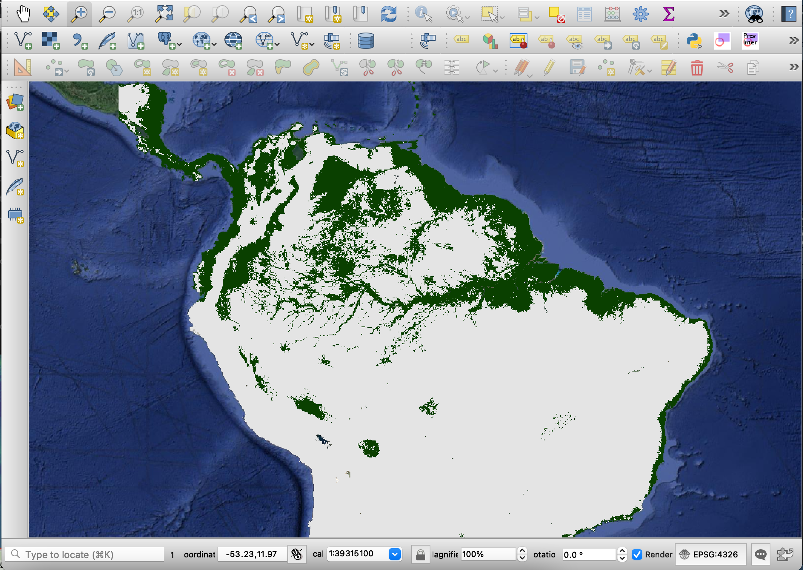
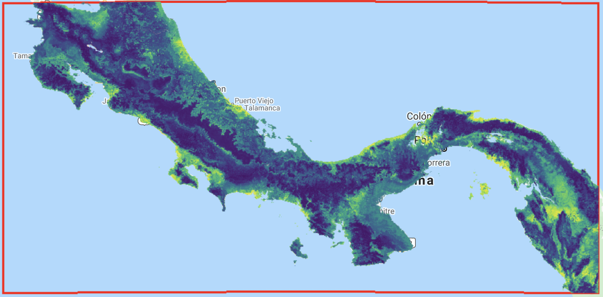
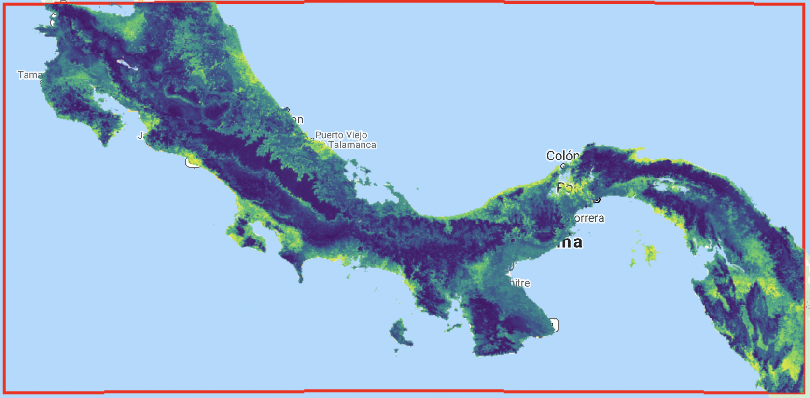

1. Smithsonian National Zoo and Conservation Biology Institute, Conservation Ecology Center, 1500 Remount Rd, Front Royal, VA 22630, USA.

2. Working Land and Seascapes, Conservation Commons, Smithsonian Institution, Washington, DC 20013, USA.

***

This is a guide for modeling species distributions and habitat suitability in Google Earth Engine. This guide is intended to explain the details of the Earth Engine code.

We first cover the basics for importing data and setting the main parameters. We then expand on different modeling workflows. 

For information on how to set up a Google Earth Engine account and guidelines and tutorials on Google Earth Engine visit: <https://developers.google.com/earth-engine/>

# General setting for running SDMs in Google Earth Engine

## Importing data as an asset

Data sets need to be uploaded as assets in Google Earth Engine. The easiest way to do this is by creating a csv file with coordinates and any other desired information. Note that you can also upload a shapefile with the species data.

Below is an example to upload the *Bradypus variegatus* data set from a csv file. Prepare a csv file with coordinates in latitude and longitude (EPSG:4326). To include a column with date use format Year/Month/Day. Date will be formatted automatically.


## Loading and cleaning your species data

To import the asset to your script you can click on the arrow forward icon on your asset manager or you can use code. We recommend using code to import data. To import the asset with the presence data use the `ee.FeatureCollection()` function and provide the asset ID. For example:

```{js, eval=F}
var Data = ee.FeatureCollection('users/yourfolder/yourdata');
```

One important step in modeling species distributions is to avoid the potential effect of spatial autocorrelation. One strategy is to ensure using only points that are at certain distance from each other, or to not have more that one data point per sampling unit (the raster pixel or grain size of the analysis).

Here we will apply a function to remove all points that lay within the same grain size. For this, we need to define the spatial resolution of our study.

```{js, eval=F}
// Define spatial resolution to work with (m)
var GrainSize = 10000; // e.g. 10 km
```

Then, we can define a function to remove duplicates and apply it to the species data set.

```{js, eval=F}
function RemoveDuplicates(data){
  var randomraster = ee.Image.random().reproject('EPSG:4326', null, GridSize);
  var randpointvals = randomraster.sampleRegions({collection:ee.FeatureCollection(data), scale: 10, geometries: true});
  return randpointvals.distinct('random');
}

var Data = RemoveDuplicates(Data);
```

The following figure exemplifies how points are rarefied at a 1 km grain size.


You can evaluate the number of points before and after removing duplicates.

```{js, eval=F}
print(ee.FeatureCollection('users/yourfolder/yourimage').size())
print(Data.size())
```

## Define your area of interest for modelling

There are different ways you can define your area of interest. You can directly draw a polygon using the drawing tools. However, here we present two methods for automating this process. 

If you are interested in working with a specific country or continent, you can use the Large Scale International Boundary Polygons data set available in GEE catalog. 

Here an example to select Kenya:

```{js, eval=F}
// Load country boundary from data catalog if working at a country scale
var AOI = ee.FeatureCollection('USDOS/LSIB_SIMPLE/2017').filter(ee.Filter.eq('country_co', 'KE'));
```

You can see the list of codes at: <https://en.wikipedia.org/wiki/List_of_FIPS_country_codes>

If you are interested in working within the entire African continent, you can use:

```{js, eval=F}
// Load country boundary from data catalog if working at a country scale
var AOI = ee.FeatureCollection('USDOS/LSIB_SIMPLE/2017').filter(ee.Filter.eq('wld_rgn', 'Africa'));
```

Another option is to select a bounding box around your species data. For example, we can define a bounding box using the function `bounds()` and add a buffer of 50 km. 

```{js, eval=F}
// Define the area of interest
var AOI = Data.geometry().bounds().buffer(50000);
```

To display the study area on the map use the following code:

```{js, eval=F}
// Add AOI to the map
Map.addLayer(AOI, {}, 'AOI', 1);
```

## Selecting predictor variables

One of the main advantages of implementing SDMs in Google Earth Engine is to make use of the extence available predictor variables. This includes not only the bioclimatic variables from Hijmans et al. (2005), but elevation data and derivatives (slope, aspect, hillside, etc.), diverse vegetation indexes, human modified indexes, night light images, land cover classifications, roads or other infrastructure and even the raw pixel values of satellite data. Depending on your area of interest, certain regions have more data availability. GEE gives the opportunity to directly include into the analysis processed satellite imagery, such as a land cover classification that you have previously conducted for your area of interest.

Selecting predictor variables is a step in which the researcher needs to have its input on the knowledge of the species, the variables that may affect its distribution, etc.

We will demonstrate different ways to import data sets with the specific examples below.

# Modeling *Bradypus variegatus* habitat suitability and distribution using presence-only data

To demonstrate the basic code to conduct SDMs in Google Earth Engine, we will use *Bradypus variegatus* as a study case. This species has been widely used to present other SDM software and R packages (Hijmans et al., 2017; Kindt, 2018; Phillips et al., 2017, 2006)  and allows as to easily compare outputs. We obtained occurrence data from GBFI (GBIF.org [20 January 2021] GBIF Occurrence Download https://doi.org/10.15468/dl.jxcv7e). We filtered data between 2000 and 2020, retaining only georeferenced records with a coordinate uncertainty < 250 m. We further cleaned the data set by removing all locations that fall on top of buildings of water bodies assuming they presented wrong coordinates.

## Loading species data

The first step is to upload the presence data set, specify the spatial scale to work with and randomly select one location per pixel. We set the grain size to 5 km.

```{js, eval=F}
///////////////////////////////
// Section 1 - Species data
///////////////////////////////

// Load presence data
var Data = ee.FeatureCollection('users/ramirocrego84/BradypusVariegatus');
print('Original data size:', Data.size());

// Define spatial resolution to work with (m)
var GrainSize = 5000;

function RemoveDuplicates(data){
  var randomraster = ee.Image.random().reproject('EPSG:4326', null, GrainSize);
  var randpointvals = randomraster.sampleRegions({collection:ee.FeatureCollection(data), scale: 10, geometries: true});
  return randpointvals.distinct('random');
}

var Data = RemoveDuplicates(Data);
print('Final data size:', Data.size());

// Add presence points to the map
Map.addLayer(Data, {color:'red'}, 'Presence', 0);
```


## Defining area of interest

The next step is to define the extent of the study or area of interest. Here we defined a 100 km buffer around the bounding box containing all presence data.

```{js, eval=F}
////////////////////////////////////////////
// Section 2 - Define Area of Interest
////////////////////////////////////////////

// Define the AOI
var AOI = Data.geometry().bounds().buffer(100000);

// Add border of study area to the map
var outline = ee.Image().byte().paint({
  featureCollection: AOI, color: 1, width: 3});
Map.addLayer(outline, {palette: 'FF0000'}, "Study Area");

// Center map to the area of interest
Map.centerObject(AOI, 3); //Number indicates the zoom level
```


## Loading predictor variables

For this example, we selected a combination of climatic predictor variables (temperature seasonality, maximum temperature of warmest month, minimum temperature of coldest month and annual precipitation) obtained from (Hijmans et al. 2005), elevation (Farr et al. 2007) and percentage tree cover at 250 m resolution obtained from the Terra MODIS Vegetation Continuous Fields (VCF) product. The product is generated yearly and produced using monthly composites of Terra MODIS Land Surface Reflectance data. We estimated mean percentage tree cover for the period of the occurrence data, 2003 to 2020 (range of presence data). All bands need to be combined into a single image. We also mask oceans from the image. 

Even though we are using just elevation for this example, note that the `ee.Algorithms.Terrain()` allows you to also calculate slope, aspect, and hillshade.

The use of the median percentage tree cover for the period of which data was recorded shows how powerful Google Earth Engine can be at the time of creating predictor variables.

```{js, eval=F}
////////////////////////////////////////////////
// Section 3 - Selecting Predictor Variables
////////////////////////////////////////////////

// Load WorldClim BIO Variables (a multiband image) from the data catalog
var BIO = ee.Image("WORLDCLIM/V1/BIO");

// Load elevation data from the data catalog and calculate slope, aspect, and a simple hillshade from the terrain Digital Elevation Model.
var Terrain = ee.Algorithms.Terrain(ee.Image("USGS/SRTMGL1_003"));

// Load NDVI 250 m collection and estimate median value per pixel
var MODIS = ee.ImageCollection("MODIS/006/MOD44B");
var MedianPTC = MODIS.filterDate('2003-01-01', '2020-12-31').select(['Percent_Tree_Cover']).median();

//var treeCover = ee.Image("UMD/hansen/global_forest_change_2019_v1_7").select(['treecover2000']);

// Combine bands into a single image
var predictors = BIO.addBands(Terrain).addBands(MedianPTC);

// Mask ocean from predictor variables
var watermask =  Terrain.select('elevation').gt(0); //Create a water mask
var predictors = predictors.updateMask(watermask).clip(AOI);

// Select bands for modeling
var bands = ['bio04','bio05','bio06','bio12','elevation','Percent_Tree_Cover'];
var predictors = predictors.select(bands);

// Display layers on the map
Map.addLayer(predictors, {bands:['elevation'], min: 0, max: 5000,  palette: ['000000','006600', '009900','33CC00','996600','CC9900','CC9966','FFFFFF',]}, 'Elevation (m)', 0);
Map.addLayer(predictors, {bands:['bio05'], min: 190, max: 400, palette:'white,red'}, 'Temperature seasonality', 0); 
Map.addLayer(predictors, {bands:['bio12'], min: 0, max: 4000, palette:'white,blue'}, 'Annual Mean Precipitation (mm)', 0); 
Map.addLayer(predictors, {bands:['Percent_Tree_Cover'], min: 1, max: 100, palette:'white,yellow,green'}, 'Percent_Tree_Cover', 0); 
```


It is important to make sure that there is no significant correlation among predictor variables that can cause collinearity effects. We account for this by estimating the Spearman correlation among predictor variable values at the presence locations. Highly correlated predictor variables should not be included in the same model.

```{js, eval=F}
// Estimate correlation among predictor variables

// Extract local covariate values from multiband predictor image at training points
var PixelVals = predictors.sampleRegions({collection: Data, scale: GrainSize, tileScale: 16});

// To check all pairwise correlations we need to map the reduceColumns function across all pairwise combinations of predictors
var CorrAll = predictors.bandNames().map(function(i){
    var tmp1 = predictors.bandNames().map(function(j){
      var tmp2 = PixelVals.reduceColumns({
        reducer: ee.Reducer.spearmansCorrelation(),
        selectors: [i, j]
      });
    return tmp2.get('correlation');
    });
    return tmp1;
  });
print('Variables correlation matrix',CorrAll);
```

## Creating pseudoabsences

In this example, we use presence only data, the most common methodology when using data from online databases such as, GBIF. We will generate pseudo-absences to fit the model. But first, we need to define the area in which random pseudo-absences can be generated. It is recommended to limit pseudo-absences within a buffer around each presence location in order to limit pseudo-absences to areas potentially accessible to the species (Araújo et al., 2019) and to account for the potential geographical or environmental sampling bias of presence records by creating pseudo-absences with a similar sampling bias (Phillips et al., 2009).

The `buffer()` function determines the area available for generating pseudo-absences, assuming that these areas have the same sampling bias than the records and represent areas where animals can disperse. 

For our example We set a wide buffer of 800 km given that *Bradypus variegatus* present a wide distribution across South America and we assumed people from across the continent can report presence records.

```{js, eval=F}
///////////////////////////////////////////////////////////////////
// Section 4 - Defining area for creation of pseudo-absence points
///////////////////////////////////////////////////////////////////

// Make an image out of the presence locations to mask from the area to generate pseudo-absences. This will impede having presence and pseudo-absences in the same pixel.
var mask = Data
  .reduceToImage({
    properties: ['random'],
    reducer: ee.Reducer.first()
}).reproject('EPSG:4326', null, ee.Number(GrainSize));

//var AreaForPA = mask.mask().updateMask(watermask).clip(AOI); //Activate this line for using the entire AOI for generating random points

// Limit pseudo-absences to a buffer around presence points. 
var buffer = 800000; // E.g., 800 km.
var AreaForPA = Data.geometry().buffer(buffer);
var AreaForPA = mask.mask().clip(AreaForPA).updateMask(watermask).clip(AOI);

Map.addLayer(AreaForPA);
```


## Model fit, model validation and model predictions

We can now fit the models. There are several functions that need to be defined.

The first function allows to create random seeds for randomly generating pseudo-absences. 

```{js, eval=F}
//////////////////////////////////
// Section 5 - Fitting SDM models
//////////////////////////////////

// Define function to generate a vector of random numbers between 1 and 1000
function runif(length) {
    return Array.apply(null, Array(length)).map(function() {
        return Math.round(Math.random() * (1000 - 1) + 1)
    });
}
```

The next two functions estimate the Area Under the Curve of the Receiver Operator Characteristic (AUC-ROC) for each run using the validation data set (Fielding and Bell, 1997). The third function calculates the threshold that maximizes sensitivity and specificity (Liu et al. 2016).

```{js, eval=F}
// Define functions to estimate ROC-AUC and calculate the threshold that maximizes sensitivity and specificity.
function getROC(img,TP){
  var Pr_Prob_Vals = img.sampleRegions({collection: TP, properties: ['PresAbs'], scale: GrainSize, tileScale: 16});
  var seq = ee.List.sequence({start: 0, end: 1, count: 20});
  return ee.FeatureCollection(seq.map(function(cutoff) {
  var Pres = Pr_Prob_Vals.filterMetadata('PresAbs','equals',1);
  // true-positive rate, sensitivity  
  var TPR = ee.Number(Pres.filterMetadata('classification','greater_than',cutoff).size()).divide(Pres.size());
  var Abs = Pr_Prob_Vals.filterMetadata('PresAbs','equals',0);
  // true-negative rate, specificity  
  var TNR = ee.Number(Abs.filterMetadata('classification','less_than',cutoff).size()).divide(Abs.size());
  // false-possitive rate
  var FPR = ee.Number(Abs.filterMetadata('classification','greater_than',cutoff).size()).divide(Abs.size());
  var SUMSS = TPR.add(TNR);
  return ee.Feature(null,{cutoff: cutoff, TPR:TPR, TNR:TNR, FPR:FPR, SUMSS:SUMSS, dist:TPR.subtract(1).pow(2).add(TNR.subtract(1).pow(2)).sqrt()});
  }));
}

function getAUC(roc){
  var X = ee.Array(roc.aggregate_array('FPR'));
  var Y = ee.Array(roc.aggregate_array('TPR')); 
  var X1 = X.slice(0,1).subtract(X.slice(0,0,-1));
  var Y1 = Y.slice(0,1).add(Y.slice(0,0,-1));
  return X1.multiply(Y1).multiply(0.5).reduce('sum',[0]).abs().toList().get(0);
}

function getThreshold(roc){
  return roc.sort({property:'SUMSS',ascending:false}).first().get("cutoff")
}
```

Finally we have the function to estimate habitat suitability. 

There are several non-parametric classifier algorithms available in GEE that can be easily implemented. These include, Random Forest, support vector machine, classification and regression trees, maximum entropy classifier, and gradient boosting.

We implemented a 5-split sample cross validation technique. The approach we use here is to randomly select a new set of pseudo-absences for each split. The number of pseudo-absences is balanced with the number of presences to avoid problems in model fitting with gradient boosting and Random Forest classifiers (Evans et al., 2011; Barbet-Massin et al. 2012).

The presence and pseudo-absence data are then randomly split in 70% for model fitting and 30% for model validation, respectively. Consequently, each of the 5 runs will have a different set of points for model fit and model validation. Two models are fit at each split, a boosted regression tree and a random forest. As a result, we create 10 models and obtain 10 accuracy metrics (AUC) and 10 threshold values for transforming habitat suitability maps into binary presence-absence maps. For each random forest model, we also calculate variable importance. The predicted habitat suitability models, the AUCs, the thresholds, the variable importance and the training and validation sets for data split are stored in a list.

```{js, eval=F}
// Define SDM function
function SDM(x) {
    var Seed = ee.Number(x);
    var PseudoAbsPoints = AreaForPA.sample({region: AOI, scale: GrainSize, numPixels: 2000, seed:Seed,         geometries: true});
    var PseudoAbsPoints = PseudoAbsPoints.randomColumn().sort('random').limit(ee.Number(npoints));
    var PseudoAbsPoints = PseudoAbsPoints.map(function(feature){
    return feature.set('PresAbs', 0);
    });
    var PseudoAbsPoints2 = PseudoAbsPoints.randomColumn({seed:Seed});
    var TrPseudoAbsPoints = PseudoAbsPoints2.filter(ee.Filter.lt('random', split));  // Filter points with 'random' property < split percentage
    var TePseudoAbsPoints = PseudoAbsPoints2.filter(ee.Filter.gte('random', split));  // Filter points with 'random' property >= split percentage
   
    // Presence
    var PresencePoints = ee.FeatureCollection(Data).randomColumn({seed:Seed});
    var PresencePoints = PresencePoints.map(function(feature){return feature.set('PresAbs', 1)})
    var TrPresencePoints = PresencePoints.filter(ee.Filter.lt('random', split));  // Filter points with 'random' property < split percentage
    var TePresencePoints = PresencePoints.filter(ee.Filter.gte('random', split));  // Filter points with 'random' property >= split percentage

    // Merge points
    var trainingPartition = TrPresencePoints.merge(TrPseudoAbsPoints);
    var testingPartition = TePresencePoints.merge(TePseudoAbsPoints);

    // Extract local covariate values from multiband predictor image at training points
    var trainPixelVals = predictors.sampleRegions({collection: trainingPartition, properties: ['PresAbs'], scale: GrainSize, tileScale: 16, geometries: true});

    // Classify using a GMO Maximum Entropy classifier
    var GTBClassifier = ee.Classifier.smileGradientTreeBoost(500).setOutputMode('PROBABILITY').train(trainPixelVals, 'PresAbs', bands); 
    var GTBClassified = predictors.select(bands).classify(GTBClassifier);
    
    // ROC-AUC
    var ROCGTB = getROC(GTBClassified, testingPartition);
    var AUCGTB = getAUC(ROCGTB);
    var thresholdGTB = getThreshold(ROCGTB);
    
    // Classify using Random Forest
    var rfClassifier = ee.Classifier.smileRandomForest(500).setOutputMode('PROBABILITY').train(trainPixelVals, 'PresAbs', bands); 
    var rfClassified = predictors.select(bands).classify(rfClassifier);

    // ROC-AUC
    var ROCrf = getROC(rfClassified, testingPartition);
    var AUCrf = getAUC(ROCrf);
    var thresholdrf = getThreshold(ROCrf);
    
    // Variable importance
    var variable_importance = ee.Feature(null, ee.Dictionary(rfClassifier.explain()).get('importance'));
    
    return ee.List([GTBClassified, AUCGTB, thresholdGTB, rfClassified, AUCrf, thresholdrf, variable_importance, trainingPartition, testingPartition]);
}
```

Now we need to define some parameters for the model. A variable with the number of presence points, the percentage for data split, and the number of individual models to fit.

```{js, eval=F}
//Calculate the number of present points to create the same number of pseudo-absences
var npoints = Data.size();

// Define partition for training and testing data
var split = 0.70;  // The proportion of the data are used to train the model

// Define number of repetitions
var numiter = 5;
```

We can now map the model function. Instead of generating random numbers, we will manually set 5 random numbers for reproducibility of our results. The length of the list determines the amount of models that will be mapped.

```{js, eval=F}
// Fit SDM 
// While the runif function can be used to generate rundom seeds, we map the SDM function over random created numbers for reproducibility of results
//var RanSeeds = runif(numiter)

var results = ee.List([34,67,98,2,65]).map(SDM);
```

To extract the different objects from the list we need to define some functions. Each will extract and save the elements of each model run.

```{js, eval=F}
///////////////////////////////////
// Section 6 - Extracting results
///////////////////////////////////

// Extract results from list
var results = results.flatten();
//print(results) //Activate this line to visualize all elements


// Extract all model predictions
var imagesGTB = ee.List.sequence(0,ee.Number(numiter).multiply(9).subtract(1),9).map(function(x){
  return results.get(x)});
var imagesrf = ee.List.sequence(3,ee.Number(numiter).multiply(9).subtract(1),9).map(function(x){
  return results.get(x)});

// You can add all the individual model predictions to the map. The number of layers to add will depend on how many iterations you selected.

// Map.addLayer(ee.Image(imagesGTB.get(0)), {
//   palette: ['white','tan', 'yellow', 'green'], 
//   min: 0, 
//   max: 1 
// }, 'MaxEnt-Run1');

// Map.addLayer(ee.Image(imagesrf.get(0)), {
//   palette: ['white','tan', 'yellow', 'green'], 
//   min: 0, 
//   max: 1 
// }, 'RF-Run1');
```

We need to extract the AUC values from the list.

```{js, eval=F}
//////////////////////////
// Extract AUC-ROC results
var AUCs = ee.List.sequence(1,ee.Number(numiter).multiply(9).subtract(1),9)
                .cat(ee.List.sequence(4,ee.Number(numiter).multiply(9).subtract(1),9))
                .map(function ExtractAUC(x){
   return results.get(x)});

//Print AUC-ROC results of each individual models 
print('AUC-ROC', AUCs);
```

The individual model accuracy is:

Model | Boosted Regression Tree AUC-ROC | Random Forest AUC-ROC
------|-------|-------
Run 1 | 0.93 | 0.95
Run 2 | 0.92 | 0.91
Run 3 | 0.91 | 0.91
Run 4 | 0.95 | 0.94
Run 5 | 0.88 | 0.88


We can now estimate the overall mean accuracy. We also want to know the variability in model accuracy. Large variability will be evidence that model performance was dependent on location of pseudo-absences. Whereas, low variability among single models is expected if models perform well and can prioritize areas in terms of their relative importance as habitat for the study species.

```{js, eval=F}
print('Mean AUC-ROC', list4.map(ExtractAUC).reduce(ee.Reducer.mean()))
print('SD AUC-ROC', list4.map(ExtractAUC).reduce(ee.Reducer.stdDev()))
```

| | AUC-ROC
-----|-----
Mean | 0.92
SD | 0.02

The next function will extract all threshold values.

```{js, eval=F}
//////////////////////////
// Extract AUC-ROC results
var Thresholds = ee.List.sequence(2,ee.Number(numiter).multiply(9).subtract(1),9)
                 .cat(ee.List.sequence(5,ee.Number(numiter).multiply(9).subtract(1),9))
                 .map(function ExtractThresholds(x){
   return results.get(x)});
print('Thresholds:', Thresholds)
```

We can examine the average variable importance for the random forest classifiers.

```{js, eval=F}
////////////////////////////////////////
// Plot averaged variable importance

var Var_Imp = ee.List.sequence(6,ee.Number(numiter).multiply(9).subtract(1),9).map(function(x){
  return results.get(x)});
var Var_Imp = ee.FeatureCollection(Var_Imp);

var Variable_Imp = Var_Imp.reduceColumns({
  reducer: ee.Reducer.mean().repeat(ee.List(bands).length()),
  selectors: bands
});

print('Variable importance', Variable_Imp);

// Chart of Variable Importance of RF Classifier
print(ui.Chart.array.values(ee.Array(Variable_Imp.get('mean')), 0, bands)
      .setChartType('ColumnChart')
      .setOptions({
        title: 'Random Forest Variable Importance',
        legend: {position: 'none'},
        hAxis: {title: 'Bands'},
        vAxis: {title: 'Importance'}
      }));
```


## Model ensembling

The final step is to perform a model ensembling. For this, the 10 individual model predictions are ensembled using a weighted mean by AUC (Marmion et al., 2009). 

```{js, eval=F}
//////////////////////////////////////////////////////////////////////////////////////////////////
// Section 7 - Model Ensembling
//////////////////////////////////////////////////////////////////////////////////////////////////

var images = imagesGTB.cat(imagesrf)
var PreEnsemble = ee.List.sequence(0, ee.Number(numiter).multiply(2).subtract(1)).map(function(i){
  return ee.Image(images.get(i)).multiply(ee.Number(AUCs.get(i)))});
var Ensemble = ee.ImageCollection.fromImages(PreEnsemble).sum().divide(ee.Number(AUCs.reduce(ee.Reducer.sum())));
// print(Ensemble);

// Add final habitat suitability layer to the map
Map.addLayer(ee.Image(Ensemble), {
  palette: ['white','tan', 'yellow', 'green'], 
  min: 0, 
  max: 0.8 
}, 'Habitat Suitability - Ensemble Model');

```


We can also calculate the distribution by transforming the habitat suitability model into a binary presence-absence map using the mean of the individual model thresholds previously calculated.

```{js, eval=F}
var binarymap = ee.Image(Ensemble).gt(ee.Number(Thresholds.reduce(ee.Reducer.mean())));
// Add final habitat suitability layer to the map
Map.addLayer(binarymap, {
  palette: ['white', 'green'], 
  min: 0, 
  max: 1
}, 'Distribution Map - Ensemble Model');
```


It is important to understand that GEE does a resampling on the fly for displaying maps. The resolution of the model will change with the zoom level. To set the visualization at the resolution of the analysis defined with the grain size, you need to specify the resolution of the image using the function `reproject()`.

```{js, eval=F}
Map.addLayer(ee.Image(Ensemble).reproject('EPSG:4326',null,GrainSize), {
  palette: ['white','tan', 'yellow', 'green'], 
  min: 0, 
  max: 0.8 
}, 'Habitat Suitability - Ensemble Model');
```

## Exporting results

It may be useful to export the results outside GEE to make maps or share results. There are different ways in which data can be exported in GEE. Here, we show how to export the final ensemble model to Google Drive. We also have code to export the training and validation data used for each model. Note that there are other options to export data in GEE (see the <https://developers.google.com/earth-engine/guides/exporting/>(user guide) for other ways to export data).

When using a fine grain size in a large extent or a large number of iterations, Google Earth Engine may reach memory limits and give an error when trying to display the resulting model. That does not mean that the models did not run. You can still export the results and visualize the resulting model in a third party GIS software.

```{js, eval=F}
//////////////////////////////////////////////////////
// Section 8 - Export outputs
//////////////////////////////////////////////////////

// Export final model to drive
 Export.image.toDrive({
   image: binarymap,
   description: 'BradypusDistribution',
   scale: GrainSize,
   maxPixels: 2000000000,
   region: AOI
});

Export.image.toDrive({
   image: Ensemble,
   description: 'BradypusEnsembleModel',
   scale: GrainSize,
   maxPixels: 2000000000,
   region: AOI
});

// Export training and validation datasets
var TrainingDatasets = ee.List.sequence(1,ee.Number(numiter).multiply(5).subtract(1),5).map(function(x){
  return results.get(x)});
//print(TrainingDatasets)

var TestingDatasets = ee.List.sequence(2,ee.Number(numiter).multiply(5).subtract(1),5).map(function(x){
  return results.get(x)});
//print(TestingDatasets)

// If you are interested in exporting any of the training or testing datasets used for modelling,
// you need to extract the feature collections from the list and export them.
// Here an example to export the validation dataset from the first run:

Export.table.toDrive({
   collectio : TestingDatasets.get(0),
   description: 'TestingDataRun1',
   fileFormat: 'CSV',
});
```

## Accounting for temporal resolution in species distribution models

One main limitation in SDMs is the consideration of temporal resolution into modeling habitat suitability and species distributions (Araújo et al., 2019). We used **Cebus capucinus** as an example to demonstrate a framework that takes advantage of GEE to match each presence record date to the closes image available.

We obtained occurrence data from GBFI (GBIF.org (27 January 2021) https://doi.org/10.15468/dl.qus4ha).We retained only georeferenced records with a coordinate uncertainty < 250 m.

For this example we will model *Cebus capucinus* distribution in Panama and Costa Rica, where most occurrence records are. 

As a note, some authors consider the subspecies *Cebus capucinus imitator* and  *Cebus capucinus capucinus* two distinct species which distribution split in central Panama (Mittermeier et al., 2013). In this study, we consider *Cebus capucinus* as one taxon.

For this analysis we will define a study area encompassing Costa Rica and Panama countries. For replicavility, we manually define a polygon geometry.

```{js, eval=F}
////////////////////////////////////
// Section 1 - Species data and AOI
////////////////////////////////////

var Data = ee.FeatureCollection('users/ramirocrego84/CebusCapucinus');

var AOI = ee.Geometry.Polygon([
  [-86.25662272529605,6.799166493750054],
  [-77.15994303779605,6.799166493750054],
  [-77.15994303779605,11.171211677305884],
  [-86.25662272529605,11.171211677305884],
  [-86.25662272529605,6.799166493750054]
]);

print('Original data size:', Data.size());
var Data = Data.filter(ee.Filter.bounds(AOI));

// Add border of study area to the map
var outline = ee.Image().byte().paint({
  featureCollection: AOI, color: 1, width: 3});
//Map.addLayer(outline, {palette: 'FF0000'}, "Study Area");

// Center map to the area of interest
Map.centerObject(AOI, 6); //Number indicates the zoom level
```



We will use data between 2003 and 2018 for model fit, removing all records from the same year within the same 250 m pixel. To do so, we need to run the `removeduplicate()` function for each year at the specified grain size and then merge all years back together.

```{js, eval=F}
//////////////////////////////////////////////////////////////
// Section 2 - Define spatial resolution and remove duplicates
//////////////////////////////////////////////////////////////

// Define spatial resolution to work with (m)
var GrainSize = 250;

function RemoveDuplicates(data){
  var randomraster = ee.Image.random().reproject('EPSG:4326', null, GrainSize);
  var randpointvals = randomraster.sampleRegions({collection:ee.FeatureCollection(data), scale: 10, geometries: true});
  return randpointvals.distinct('random');
}

// Filter by year and eliminate points withing the same pixel at each year
var Data03 = RemoveDuplicates(Data.filter(ee.Filter.rangeContains('Date', '2003-01-01', '2003-12-31')));
var Data04 = RemoveDuplicates(Data.filter(ee.Filter.rangeContains('Date', '2004-01-01', '2004-12-31')));
var Data05 = RemoveDuplicates(Data.filter(ee.Filter.rangeContains('Date', '2005-01-01', '2005-12-31')));
var Data06 = RemoveDuplicates(Data.filter(ee.Filter.rangeContains('Date', '2006-01-01', '2006-12-31')));
var Data07 = RemoveDuplicates(Data.filter(ee.Filter.rangeContains('Date', '2007-01-01', '2007-12-31')));
var Data08 = RemoveDuplicates(Data.filter(ee.Filter.rangeContains('Date', '2008-01-01', '2008-12-31')));
var Data09 = RemoveDuplicates(Data.filter(ee.Filter.rangeContains('Date', '2009-01-01', '2009-12-31')));
var Data10 = RemoveDuplicates(Data.filter(ee.Filter.rangeContains('Date', '2010-01-01', '2010-12-31')));
var Data11 = RemoveDuplicates(Data.filter(ee.Filter.rangeContains('Date', '2011-01-01', '2011-12-31')));
var Data12 = RemoveDuplicates(Data.filter(ee.Filter.rangeContains('Date', '2012-01-01', '2012-12-31')));
var Data13 = RemoveDuplicates(Data.filter(ee.Filter.rangeContains('Date', '2013-01-01', '2013-12-31')));
var Data14 = RemoveDuplicates(Data.filter(ee.Filter.rangeContains('Date', '2014-01-01', '2014-12-31')));
var Data15 = RemoveDuplicates(Data.filter(ee.Filter.rangeContains('Date', '2015-01-01', '2015-12-31')));
var Data16 = RemoveDuplicates(Data.filter(ee.Filter.rangeContains('Date', '2016-01-01', '2016-12-31')));
var Data17 = RemoveDuplicates(Data.filter(ee.Filter.rangeContains('Date', '2017-01-01', '2017-12-31')));
var Data18 = RemoveDuplicates(Data.filter(ee.Filter.rangeContains('Date', '2018-01-01', '2018-12-31')));

// Combine all datasets
var Data2 = Data03.merge(Data04).merge(Data05).merge(Data06).merge(Data07)
            .merge(Data08).merge(Data09).merge(Data10).merge(Data11).merge(Data12)
            .merge(Data13).merge(Data14).merge(Data15).merge(Data16).merge(Data17).merge(Data18);
```

We will use mean annual temperature, annual precipitation (Hijmans et al. 2005), elevation (Farr et al. 2007) and percentage tree cover (Terra MODIS VCF, 250 m resolution) as predictor variables. We set the grain size of the analysis at 250 m resolution to match the MODIS data. 

```{js, eval=F}
//////////////////////////////////////////////
// Section 3 - Selecting Predictor Variables
//////////////////////////////////////////////

// Load bioclimatic dataset
var BIO = ee.Image("WORLDCLIM/V1/BIO");

// Load elevation data 
var Elevation = ee.Image("USGS/SRTMGL1_003");

// Combine bands into a single image
var predictors = BIO.addBands(Elevation);

// Load MODIS surface reflectance
var start = ee.Date('2003-01-01');
var end = ee.Date('2020-01-01');
var MODIS = ee.ImageCollection("MODIS/006/MOD44B")
             .filterDate(start, end);

// Mask ocean from predictor variables
var watermask =  Elevation.gt(0); //Create a water mask
var predictors = predictors.updateMask(watermask).clip(AOI);
var bands = ['bio01','bio12','elevation','Percent_Tree_Cover'];

Map.addLayer(predictors, {bands:['elevation'], min: 0, max: 5000,  palette: ['000000','006600', '009900','33CC00','996600','CC9900','CC9966','FFFFFF',]}, 'Elevation (m)', 0);
Map.addLayer(MODIS.first(), {bands:['Percent_Tree_Cover'], min: 0, max: 100, palette:'white,yellow,green'}, 'Percent_Tree_Cover', 0); 
```

For each data location, we need to identify the closest recorded MODIS image and extracted the percentage tree cover value. We need to define a series of function to do this. In this case, because the data product is produced yearly, we define a max difference of 360 days.

```{js, eval=F}
/////////////////////////////////////////////////////////////////////////////////
// Section 4 - Match each point to the closes image and extract the pixel value
/////////////////////////////////////////////////////////////////////////////////

// Function to add property with time in milliseconds to the data
var add_date = function(feature) {
  return feature.set({date_millis: ee.Date(ee.String(feature.get("Date"))).millis()});
};
var Data2 = Data2.map(add_date);

// Join Image and Points based on a maxDifference Filter within a day
var tempwin = 360;  // set time window (days)

var maxDiffFilter = ee.Filter.maxDifference({
  difference: tempwin * 24 * 60 * 60 * 1000,  // 8 day * hr * min * sec * milliseconds
  leftField: 'date_millis', //date data was collected
  rightField: 'system:time_start' // image date
});

// Define the join.
var saveBestJoin = ee.Join.saveBest({
  matchKey: 'bestImage',
  measureKey: 'timeDiff'
});

// Apply the Join
var Data_match = saveBestJoin.apply(Data2, MODIS, maxDiffFilter);
//print(Data_match.limit(2)) //Activate to visualize results

// Function to add property with Percent Tree Cover value from the matched MODIS image
var add_value = function(feature) {
   var img1 = ee.Image(feature.get('bestImage')).select('Percent_Tree_Cover');
   var point = feature.geometry();
   var pixel_Value = img1.sample({region: point, scale: 10, tileScale: 15, dropNulls: false});
   return feature.set({Percent_Tree_Cover: pixel_Value.first().get('Percent_Tree_Cover')});
};

var DataFinal = Data_match.map(add_value);

// Remove points that were outside MODIS image footprint (e.g., in the ocean)
var DataFinal = DataFinal.filter(ee.Filter.neq('Percent_Tree_Cover', null))

// See the final number of presence locations for analysis
print('Presence data size:', DataFinal.size());
//print(DataFinal.limit(2)) //Activate to visualize results
Map.addLayer(DataFinal, {color:'red'}, 'Presence', 1)  //Add points to the map
```


After all this process, we end with 330 occurrence records.

The next step is to define an area to create pseudo-absences. We will first create an image where presence records are marked to avoid creating pseudo-absences in the same locations we have presences.

```{js, eval=F}
///////////////////////////////////////////////////////////////////
// Section 5 - Defining area for creation of pseudo-absence points
///////////////////////////////////////////////////////////////////

// Make an image out of the presence locations to mask from the area to generate pseudo-absences. This will impede having presence and pseudo-absences in a 1km around the presence location.
var mask = DataFinal
  .reduceToImage({
    properties: ['random'],
    reducer: ee.Reducer.first()
}).reproject('EPSG:4326', null, ee.Number(1000));

var AreaForPA = mask.mask().updateMask(watermask).clip(AOI);
Map.addLayer(AreaForPA)
```

To create pseudo-absences, we implemented a 5 repeated sample splits framework. For each occurrence location, we generated a random pseudo-absence point within a 100 km buffer, extracting elevation, mean annual temperature, annual precipitation and the percent tree cover from the VCF image that corresponded to the time period of the occurrence point. In this way we ended with 5 balanced data sets, each with a different set of pseudo-absences. 

To do this we defined a function that creates a random point within a 100 km buffer and extracts the pixel value of the percent tree cover image. We then merge the presence data with the pseudo-absences. Finally, we extract the value for elevation, mean annual temperature, annual precipitation. Each of the 5 resulting training data sets is fit with a Random Forest. 

We pack all this into a function that we can map across a list of random numbers.

```{js, eval=F}
///////////////////////////
// Section 6 - Model fit
///////////////////////////

// Define SDM function
function SDM(x) {
    // Presence points
    var PresencePoints = DataFinal.map(function(feature){return feature.set('PresAbs', 1)});
    var PresencePoints = predictors.sampleRegions({collection: PresencePoints, properties: ['PresAbs', 'Percent_Tree_Cover'], scale: 250, tileScale: 4});
    var npoints = PresencePoints.size();
    
    // Pseudoabsences
    var PseudoAbs = DataFinal.map(function(feature){
                        var img1 = ee.Image(feature.get('bestImage')).select('Percent_Tree_Cover');
                        var pointbuff = feature.geometry().buffer(100000);
                        var randpoints = AreaForPA.sample({region: pointbuff, scale: 10, numPixels: 30, seed:x, geometries: true, tileScale: 15, dropNulls: true}); // If error appears on drop null, increase the number of pixels
                        var PTC = img1.sampleRegions({collection: randpoints, scale: 10, tileScale: 16, geometries: true});
                        return PTC.first();
                      });
    var PseudoAbs = PseudoAbs.map(function(feature){return feature.set('PresAbs', 0)});
    var PseudoAbsPoints = predictors.sampleRegions({collection: PseudoAbs, properties: ['PresAbs', 'Percent_Tree_Cover'], scale: 250, tileScale: 4, geometries: true});

    // Merge points
    var trainingData = PresencePoints.merge(PseudoAbsPoints);

    // Classify using Random Forest
    var rfClassifier = ee.Classifier.smileRandomForest(500).setOutputMode('PROBABILITY').train(trainingData, 'PresAbs', bands); 
   
    return ee.List([rfClassifier, trainingData]);
}
```

We can now fit the models. We use defined random numbers for reproducibility of our results.

```{js, eval=F}
// Define number of repetitions
var numiter = 5;

// Fit SDM
var results = ee.List([81,96,57,22,2]).map(SDM);

// Extract results from list
var results = results.flatten();
//print(results) //Activate this line to visualize all elements

```

Because model predictions will vary each year due to changes in underlying predictor variables, we withheld data from 2019 for model validation. This out-of-bag sample (2019) had a large number of occurrence records and was the last year the MODIS VCF was available in GEE. Using these data has the assumption that if the model predicts well for data in 2019, then the model likely performed well in other years and is useful for predictions. We used 125 occurrence records, and a set of 125 pseudo-absences randomly created across the study area (100 km buffer around each occurrence location) to estimate the AUC for each of the five individual model predictions using the percentage of tree cover for 2019, together with mean annual temperature, annual precipitation and elevation as the predictor variables. 

We need to define the AUC-ROC functions as we did in the previous example.

```{js, eval=F}
////////////////////////////////////
// Section 7 - Accuracy assessment
////////////////////////////////////

// Define functions to estimate ROC-AUC
function getROC(img,TP){
  var Pr_Prob_Vals = img.sampleRegions({collection: TP, properties: ['PresAbs'], scale: GrainSize, tileScale: 16});
  var seq = ee.List.sequence({start: 0, end: 1, count: 20});
  return ee.FeatureCollection(seq.map(function(cutoff) {
  var Pres = Pr_Prob_Vals.filterMetadata('PresAbs','equals',1);
  // true-positive rate, sensitivity  
  var TPR = ee.Number(Pres.filterMetadata('classification','greater_than',cutoff).size()).divide(Pres.size());
  var Abs = Pr_Prob_Vals.filterMetadata('PresAbs','equals',0);
  // true-negative rate, specificity  
  var TNR = ee.Number(Abs.filterMetadata('classification','less_than',cutoff).size()).divide(Abs.size());
  // false-possitive rate
  var FPR = ee.Number(Abs.filterMetadata('classification','greater_than',cutoff).size()).divide(Abs.size());
  var SUMSS = TPR.add(TNR);
  return ee.Feature(null,{cutoff: cutoff, TPR:TPR, TNR:TNR, FPR:FPR, SUMSS:SUMSS, dist:TPR.subtract(1).pow(2).add(TNR.subtract(1).pow(2)).sqrt()});
  }));
}

function getAUC(roc){
  var X = ee.Array(roc.aggregate_array('FPR'));
  var Y = ee.Array(roc.aggregate_array('TPR')); 
  var X1 = X.slice(0,1).subtract(X.slice(0,0,-1));
  var Y1 = Y.slice(0,1).add(Y.slice(0,0,-1));
  return X1.multiply(Y1).multiply(0.5).reduce('sum',[0]).abs().toList().get(0);
}


// Extract all model classifiers
var classifiers = ee.List.sequence(0,ee.Number(numiter).multiply(2).subtract(1),2)
                  .map(function(x){return results.get(x)});
                  
// We will use 2019 data to validate the model
var Data19 = RemoveDuplicates(ee.FeatureCollection('users/ramirocrego84/CebusCapucinus').filter(ee.Filter.rangeContains('Date', '2019-01-01', '2019-12-31')));
var Presence19 = Data19.map(function(feature){return feature.set('PresAbs', 1)});
Map.addLayer(Presence19, {color:'red'}, 'Presence 2019', 1)  //Add points to the map

// Make an image out of the presence locations to mask from the area to generate pseudo-absences. This will impede having presence and pseudo-absences near the same pixel.
var mask2 = Presence19
  .reduceToImage({
    properties: ['random'],
    reducer: ee.Reducer.first()
}).reproject('EPSG:4326', null, ee.Number(1000));

// Limit pseudoabsences to a buffer around presence points. 
var buffer = 100000; // E.g., 100 km.
var AreaForPA2 = Data19.geometry().buffer(buffer);
var AreaForPA2 = mask2.mask().clip(AreaForPA2).updateMask(watermask).clip(AOI);

// Create random pseudoabsences
var Abs19 = AreaForPA2.sample({region: AOI, scale: GrainSize, numPixels: 1000, geometries: true}); //Because many points will on the ocean, we need to create more than needed.
var Abs19 = Abs19.randomColumn().sort('random').limit(Presence19.size()); // We keep the same amount of pseudoabsences than presences
var Abs19 = Abs19.map(function(feature){
    return feature.set('PresAbs', 0);
    });
print('Pr19', Presence19.size());
print('PsAb19', Abs19.size());

// Merge presence and pseudo-absences
var testingdata2019 = Presence19.merge(Abs19);

// Create the predictor variables for 2019
var mod2019 = MODIS.filterDate('2019-01-01', '2019-12-31').select(['Percent_Tree_Cover']).first();
var pred19 = predictors.addBands(mod2019);

// Predict HSI for 2019 and estimate ROC-AUC
function accuracy(x){
  var Classifier = classifiers.get(x);
  var HSM = pred19.classify(Classifier);
  var ROC = getROC(HSM, testingdata2019);
  return getAUC(ROC);
}

var AUCs = ee.List.sequence(0,ee.Number(numiter).subtract(1),1).map(accuracy);

//Print AUC-ROC results of each individual models 
print('AUC-ROC', AUCs);
```


---

The individual model accuracy is:

Model | Random Forest AUC-ROC
------|-------|-------
Run 1 | 0.89 
Run 2 | 0.88
Run 3 | 0.89
Run 4 | 0.89
Run 5 | 0.85

We can now estimate the overall mean accuracy. We also want to know the variability in model accuracy. Large variability will be evidence that model performance was dependent on location of pseudo-absences. Whereas, low variability among single models is expected if models perform well and can prioritize areas in terms of their relative importance as habitat for the study species.

```{js, eval=F}
// Print AUC-ROC mean and SD among models
print('Mean AUC-ROC', AUCs.reduce(ee.Reducer.mean()));
print('SD AUC-ROC', AUCs.reduce(ee.Reducer.stdDev()));
```

| | AUC-ROC
-----|-----
Mean | 0.88
SD | 0.01

After validating our models, we can predict suitable habitat across all years in the Terra MODIS VCF image composite. We need to define a function that adds the Terra MODIS VCF of each year to the mean annual temperature, annual precipitation and elevations variables and predicts the habitat suitability for each single model. We then obtain the median habitat suitability per pixel as the final prediction.

```{js, eval=F}
///////////////////////////
// Section 8 - Predictions
///////////////////////////

var PTC = ee.ImageCollection("MODIS/006/MOD44B").select(['Percent_Tree_Cover']);
var HSI = PTC.map(function(img){
  var predimg = predictors.addBands(img); 
  return ee.ImageCollection.fromImages(ee.List.sequence(0,ee.Number(numiter).subtract(1),1)
  .map(function prediction(x){
        var Classifier = classifiers.get(x);
        return predimg.classify(Classifier)}))
  .median().copyProperties(img, ['system:time_start']);
  });

print(HSI);
```

We can plot some outputs. We need to convert the resulting image collection into a list to display each year. Here we display years 2003, 2011 and 2019.

```{js, eval=F}
// Define RGB visualization parameters.
var visParams = {
  min: 0,
  max: 0.8,
  palette: ['white','tan', 'yellow', 'green'],
};

var HSIlist = HSI.toList(20); 
// Add final habitat suitability layer to the map
Map.addLayer(ee.Image(HSIlist.get(3)), visParams, 'Habitat Suitability - 2003');
Map.addLayer(ee.Image(HSIlist.get(11)), visParams, 'Habitat Suitability - 2011');
Map.addLayer(ee.Image(HSIlist.get(19)), visParams, 'Habitat Suitability - 2019');
```






To assess habitat suitability change across time, we fit a pixel based linear regression. We then plot the slope of the linear regression for each pixel. Positive values indicate an increase in habitat suitability and negative values indicate a decrease in habitat suitability.

```{js, eval=F}
///////////////////////////////////////////////////
// Section 9 - Fit linear regression on each pixel
///////////////////////////////////////////////////

// Add a band containing image date as years since start date of MODIS image collection.
function createTimeBand(img) {
  var year = img.date().difference(ee.Date('2000-03-05'), 'year');
  return ee.Image(year).float().addBands(img);
}

// Fit a linear trend to the habitat suitability collection.
var collection = HSI.select(['classification'])
    .map(createTimeBand);

var LinearFit = collection.reduce(ee.Reducer.linearFit());

// Display HSI linear regression slope image.
Map.addLayer(LinearFit, {
  min: -0.01,
  max: 0.01,
  bands: 'scale', // 'scale' = regression slope
  palette: ['cc0000','ff7431','d6c92b','e8f166','e8f166','8cff78','13ff10','137e00'] // red, yellow, green
}, 'Linear regression slope'); // title
```


It is also possible to create a gif animation showing the change of habitat suitability across years.

```{js, eval=F}
// Create RGB visualization images for use as animation frames.
var rgbVis = HSM.map(function(img) {
  var scale = 250;
  return img.visualize(visParams);
});

// Define GIF visualization parameters.
var gifParams = {
  'region': geometry2,
  'dimensions': 500,
  'crs': 'EPSG:3857',
  'framesPerSecond': 2
};

//Print the GIF URL to the console.
print(rgbVis.getVideoThumbURL(gifParams));
```


As before, we can export results into Google Drive.

```{js, eval=F}
//////////////////////////////////////////////////////
// Section 10 - Export final map
//////////////////////////////////////////////////////

// Export final model to drive
 Export.image.toDrive({
   image: LinearFit,
   description: 'Cebuscapucinus',
   scale: GrainSize,
   maxPixels: 2000000000,
   region: AOI
});
```


# Modeling presence-absence data

Using presence and absence data is always recommended for SDM analysis.

Here we present the code that will allow you to fit an SDM using presence and absence data. Because there is no need to create pseudo-absences, the code has some modifications from the previous examples. However, the work flow is very similar. 

It is important that the data set that is uploaded into GEE as an asset contains a field with 1 indicating presence and 0 indicating absence for each location. 


```{js, eval=F}
// Presence absence model

//////////////////////////////
// Section 1 - Species data
//////////////////////////////

// Load presence absence data
var Data = ee.FeatureCollection('users/yourdata');
print('Data size:', Data.size());

// Define grid size to work with (m)
var GrainSize = 5000;

// Add presence points to the map
Map.addLayer(Data, {color:'red'}, 'Presence', 1);

////////////////////////////////////////
// Section 2 - Define Area of Interest
////////////////////////////////////////

// Define the AOI
var AOI = Data.geometry().bounds().buffer(100000);

// Add border of study area to the map
var outline = ee.Image().byte().paint({
  featureCollection: AOI, color: 1, width: 3});
Map.addLayer(outline, {palette: 'FF0000'}, "Study Area");
  
// Center map to the area of interest
Map.centerObject(AOI, 10); //Number indicates the zoom level
  
////////////////////////////////////////////////
// Section 3 - Selecting Predictor Variables
////////////////////////////////////////////////

// Load elevation data from the data catalog and calculate slope, aspect, and a simple hillshade from the terrain Digital Elevation Model.
var Terrain = ee.Algorithms.Terrain(ee.Image("USGS/SRTMGL1_003"));
var Terrain = Terrain.select(['elevation','slope','aspect']); // Select elevation, slope and aspect

// Combine bands into a single image
var predictors = Terrain.clip(AOI);

// Select bands for modeling
var bands = ['elevation','slope','aspect'];
var predictors = predictors.select(bands);

Map.addLayer(predictors.clip(AOI), {bands:['elevation'], min: 900, max: 1700,  palette: ['000000','006600', '009900','33CC00','996600','CC9900','CC9966','FFFFFF',]}, 'Elevation (m)', 0);
Map.addLayer(predictors.clip(AOI), {bands:['slope'], min: 0, max: 45, palette:'white,red'}, 'Slope (Degrees)', 0); 
Map.addLayer(predictors.clip(AOI), {bands:['aspect'], min: 0, max: 350, palette:'red,blue'}, 'Aspect (Degrees)', 0); 

// Estimate correlation among predictor variables

// Extract local covariate values from multiband predictor image at training points
var PixelVals = predictors.sampleRegions({collection: Data, scale: GrainSize, tileScale: 16});

// To check all pairwise correlations we need to map the reduceColumns function across all pairwise combinations of predictors
var CorrAll = predictors.bandNames().map(function(i){
    var tmp1 = predictors.bandNames().map(function(j){
      var tmp2 = PixelVals.reduceColumns({
        reducer: ee.Reducer.spearmansCorrelation(),
        selectors: [i, j]
      });
    return tmp2.get('correlation');
    });
    return tmp1;
  });
print('Variables correlation matrix',CorrAll);

///////////////////////////////////
// Section 4 - Fitting SDM models
///////////////////////////////////

// Define function to generate a vector of random numbers between 1 and 1000
function runif(length) {
    return Array.apply(null, Array(length)).map(function() {
        return Math.round(Math.random() * (1000 - 1) + 1);
    });
}

// Define functions to estimate ROC-AUC and calculate the threshold that maximizes sensitivity and specificity.
function getROC(img,TP){
  var Pr_Prob_Vals = img.sampleRegions({collection: TP, properties: ['PresAbs'], scale: GrainSize, tileScale: 16});
  var seq = ee.List.sequence({start: 0, end: 1, count: 20});
  return ee.FeatureCollection(seq.map(function(cutoff) {
  var Pres = Pr_Prob_Vals.filterMetadata('PresAbs','equals',1);
  // true-positive rate, sensitivity  
  var TPR = ee.Number(Pres.filterMetadata('classification','greater_than',cutoff).size()).divide(Pres.size());
  var Abs = Pr_Prob_Vals.filterMetadata('PresAbs','equals',0);
  // true-negative rate, specificity  
  var TNR = ee.Number(Abs.filterMetadata('classification','less_than',cutoff).size()).divide(Abs.size());
  // false-possitive rate
  var FPR = ee.Number(Abs.filterMetadata('classification','greater_than',cutoff).size()).divide(Abs.size());
  var SUMSS = TPR.add(TNR);
  return ee.Feature(null,{cutoff: cutoff, TPR:TPR, TNR:TNR, FPR:FPR, SUMSS:SUMSS, dist:TPR.subtract(1).pow(2).add(TNR.subtract(1).pow(2)).sqrt()});
  }));
}

function getAUC(roc){
  var X = ee.Array(roc.aggregate_array('FPR'));
  var Y = ee.Array(roc.aggregate_array('TPR')); 
  var X1 = X.slice(0,1).subtract(X.slice(0,0,-1));
  var Y1 = Y.slice(0,1).add(Y.slice(0,0,-1));
  return X1.multiply(Y1).multiply(0.5).reduce('sum',[0]).abs().toList().get(0);
}

function getThreshold(roc){
  return roc.sort({property:'SUMSS',ascending:false}).first().get("cutoff")
}


// Define SDM function
function SDM(x) {
    var Seed = ee.Number(x);
    var AbsPoints = ee.FeatureCollection(Data).filter(ee.Filter.eq('PresAbs',0)); //Filter all absence points
    var AbsPoints2 = AbsPoints.randomColumn({seed:Seed});
    var TrAbsPoints = AbsPoints2.filter(ee.Filter.lt('random', split));  // Filter points with 'random' property < split percentage
    var TeAbsPoints = AbsPoints2.filter(ee.Filter.gte('random', split));  // Filter points with 'random' property >= split percentage
    // Presence
    var PresencePoints = ee.FeatureCollection(Data).filter(ee.Filter.eq('PresAbs',1)); //Filter all presence points
    var PresencePoints = PresencePoints.randomColumn({seed:Seed});
    var TrPresencePoints = PresencePoints.filter(ee.Filter.lt('random', split));  // Filter points with 'random' property < split percentage
    var TePresencePoints = PresencePoints.filter(ee.Filter.gte('random', split));  // Filter points with 'random' property >= split percentage

    // Merge points
    var trainingPartition = TrPresencePoints.merge(TrAbsPoints);
    var testingPartition = TePresencePoints.merge(TeAbsPoints);
    
    // Extract local covariate values from multiband predictor image at training points
    var trainPixelVals = predictors.sampleRegions({collection: trainingPartition, properties: ['PresAbs'], scale: GrainSize, tileScale: 16});

    // Classify using Random Forest
    var rfClassifier = ee.Classifier.smileRandomForest(500).setOutputMode('PROBABILITY').train(trainPixelVals, 'PresAbs', bands); 
    var rfClassified = predictors.select(bands).classify(rfClassifier);

    // ROC-AUC
    var ROCrf = getROC(rfClassified, testingPartition);
    var AUCrf = getAUC(ROCrf);
    var thresholdrf = getThreshold(ROCrf);
    
    // Variable importance
    var variable_importance = ee.Feature(null, ee.Dictionary(rfClassifier.explain()).get('importance'));
    
    return ee.List([rfClassified, AUCrf, thresholdrf, variable_importance, trainingPartition, testingPartition]);
}


// Define partition for training and testing data
var split = 0.70;  // The proportion of the data are used to train the model

// Define number of repetitions
var numiter = 10;

// Fit SDM 
// Create random seeds
var RanSeeds = runif(numiter)
var results = RanSeeds.map(SDM);

///////////////////////////////////
// Section 5 - Extracting results
///////////////////////////////////

// Extract results from list
var results = ee.List(results).flatten();
//print(results) //Activate this line to visualize all elements


// Extract all model predictions
var imagesrf = ee.List.sequence(0,ee.Number(numiter).multiply(6).subtract(1),6).map(function(x){
  return results.get(x)});

// You can add all the individual model predictions to the map. The number of layers to add will depend on how many iterations you selected.

// Map.addLayer(ee.Image(imagesMaxEnt.get(0)), {
//   palette: ['white','tan', 'yellow', 'green'], 
//   min: 0, 
//   max: 1 
// }, 'MaxEnt-Run1');

// Map.addLayer(ee.Image(imagesrf.get(0)), {
//   palette: ['white','tan', 'yellow', 'green'], 
//   min: 0, 
//   max: 1 
// }, 'RF-Run1');

//////////////////////////
// Extract AUC-ROC results
var AUCs = ee.List.sequence(1,ee.Number(numiter).multiply(6).subtract(1),6)
                .map(function ExtractAUC(x){
   return results.get(x)});

//Print AUC-ROC results of each individual models 
print('AUC-ROC', AUCs);

// Print AUC-ROC mean and SD among models
print('Mean AUC-ROC', AUCs.reduce(ee.Reducer.mean()));
print('SD AUC-ROC', AUCs.reduce(ee.Reducer.stdDev()));
 
//////////////////////////
// Extract AUC-ROC results
var Thresholds = ee.List.sequence(2,ee.Number(numiter).multiply(6).subtract(1),6)
                 .map(function ExtractThresholds(x){
   return results.get(x)});
//print('Thresholds:', Thresholds)

////////////////////////////////////////
// Plot averaged variable importance

var Var_Imp = ee.List.sequence(3,ee.Number(numiter).multiply(6).subtract(1),6).map(function(x){
  return results.get(x)});
var Var_Imp = ee.FeatureCollection(Var_Imp);

var Variable_Imp = Var_Imp.reduceColumns({
  reducer: ee.Reducer.mean().repeat(ee.List(bands).length()),
  selectors: bands
});

//print('Variable importance', Variable_Imp);

// Chart of Variable Importance of RF Classifier
print(ui.Chart.array.values(ee.Array(Variable_Imp.get('mean')), 0, bands)
      .setChartType('ColumnChart')
      .setOptions({
        title: 'Random Forest Variable Importance',
        legend: {position: 'none'},
        hAxis: {title: 'Bands'},
        vAxis: {title: 'Importance'}
      }));

//////////////////////////////////
// Section 6 - Model Ensembling
//////////////////////////////////
var images = imagesrf
var PreEnsemble = ee.List.sequence(0, ee.Number(numiter).subtract(1)).map(function(i){
  return ee.Image(images.get(i)).multiply(ee.Number(AUCs.get(i)))});
var Ensemble = ee.ImageCollection.fromImages(PreEnsemble).sum().divide(ee.Number(AUCs.reduce(ee.Reducer.sum())));
// print(Ensemble);

// Add final habitat suitability layer to the map
Map.addLayer(ee.Image(Ensemble), {
  palette: ['white','tan', 'yellow', 'green'], 
  min: 0, 
  max: 0.8 
}, 'Habitat Suitability - Ensemble Model');

var binarymap = ee.Image(Ensemble).gt(ee.Number(Thresholds.reduce(ee.Reducer.mean())));
// Add final habitat suitability layer to the map
Map.addLayer(binarymap, {
  palette: ['white', 'green'], 
  min: 0, 
  max: 1
}, 'Distribution Map - Ensemble Model');


/////////////////////////////////
// Section 7 - Export outputs
/////////////////////////////////

// Export final model to drive
// Export.image.toDrive({
//   image: binarymap,
//   description: 'Distribution',
//   scale: GrainSize,
//   maxPixels: 2000000000,
//   region: AOI
// });

// Export.image.toDrive({
//   image: Ensemble,
//   description: 'EnsembleModel',
//   scale: GrainSize,
//   maxPixels: 2000000000,
//   region: AOI
// });

// Export training and validation datasets
var TrainingDatasets = ee.List.sequence(5,ee.Number(numiter).multiply(9).subtract(1),9).map(function(x){
  return results.get(x)});
//print(TrainingDatasets)

var TestingDatasets = ee.List.sequence(6,ee.Number(numiter).multiply(9).subtract(1),9).map(function(x){
  return results.get(x)});
//print(TestingDatasets)

// If you are interested in exporting any of the training or testing data sets used for modeling,
// you need to extract the feature collections from the list and export them.
// Here an example to export the validation data set from the first run:

// Export.table.toDrive({
//   collectio : TestingDatasets.get(0),
//   description: 'TestingDataRun1',
//   fileFormat: 'CSV',
// });
```


## References

Araújo, M. B., Anderson, R. P., Barbosa, A. M., Beale, C. M., Dormann, C. F., Early, R., Garcia, R. A., Guisan, A., Maioran, L., Naimi, B., O’Hara, R. B., Zimmermann, N. E., & Rahbek, C. (2019). Standards for distribution models in biodiversity assessments. Science Advances, 5(1), 1–12. https://doi.org/10.1126/sciadv.aat4858

Barbet-Massin, M., Jiguet, F., Albert, C. H., & Thuiller, W. (2012). Selecting pseudo-absences for species distribution models: How, where and how many? Methods in Ecology and Evolution, 3(2), 327–338. https://doi.org/10.1111/j.2041-210X.2011.00172.x

Evans, J. S., Murphy, M. A., Holden, Z. A., & Cushman, S. A. (2011). Modeling Species Distribution and Change Using Random Forest. In C. A. Drew, Y. F. Wiersma, & F. Huettmann (Eds.), Predictive Species and Habitat Modeling in Landscape Ecology: Concepts and Applications (pp. 139–159). New York, NY: Springer New York. https://doi.org/10.1007/978-1-4419-7390-0_8

Farr, T. G., Rosen, P. A., Caro, E., Crippen, R., Duren, R., Hensley, S., Kobrick, M., Paller, M., Rodriguez, E., Roth, L., Seal, D., Shaffer, S., Shimada, J., Umland, J., Werner, M., Oskin, M., Burbank, D., &Alsdorf, D. (2007). The shuttle radar topography mission. Reviews of Geophysics, 45(2), RG2004. https://doi.org/10.1029/2005RG000183

Fielding, A. H., & Bell, J. F. (1997). A review of methods for the assessment of prediction errors in conservation presence/absence models. Environmental Conservation, 24(1), 38–49. https://doi.org/10.1017/S0376892997000088

Hijmans, R.J., Cameron, S.E., Parra, J.L., Jones, P.G., & Jarvis, A. (2005). Very High Resolution Interpolated Climate Surfaces for Global Land Areas. International Journal of Climatology 25: 1965-1978.

Hijmans, R. J., Phillips, S., Leathwick, J., & Elith, J. (2017). dismo: Species distribution modeling. R package version 1.1-4.

Kindt, R. (2018). Ensemble species distribution modelling with transformed suitability values. Environmental Modelling and Software, 100, 136–145. https://doi.org/10.1016/j.envsoft.2017.11.009

Liu, C., Newell, G., & White, M. (2016). On the selection of thresholds for predicting species occurrence with presence-only data. Ecology and Evolution, 6(1), 337–348. https://doi.org/10.1002/ece3.1878

Marmion, M., Parviainen, M., Luoto, M., Heikkinen, R. K., & Thuiller, W. (2009). Evaluation of consensus methods in predictive species distribution modelling. Diversity and Distributions, 15(1), 59–69. https://doi.org/10.1111/j.1472-4642.2008.00491.x

Mittermeier, R. A., Rylands, A. B., & Wilson, D. E., (Eds.). (2013). Handbook of the Mammals of the World: Volume 3, Primates. Barcelona, Spain.: Linx Ediciones.

Phillips, S. J., Anderson, R. P., Dudík, M., Schapire, R. E., & Blair, M. E. (2017). Opening the black box: an open-source release of Maxent. Ecography, 40(7), 887–893. https://doi.org/10.1111/ecog.03049

Phillips, S. J., Anderson, R. P., & Schapire, R. E. (2006). Maximum entropy modeling of species geographic distributions. Ecological Modelling, 190(3–4), 231–259. https://doi.org/10.1016/j.ecolmodel.2005.03.026

Phillips, S. J., Dudík, M., Elith, J., Graham, C. H., Lehmann, A., Leathwick, J., & Ferrier, S. (2009). Sample selection bias and presence-only distribution models: Implications for background and pseudo-absence data. Ecological Applications, 19(1), 181–197. https://doi.org/10.1890/07-2153.1
